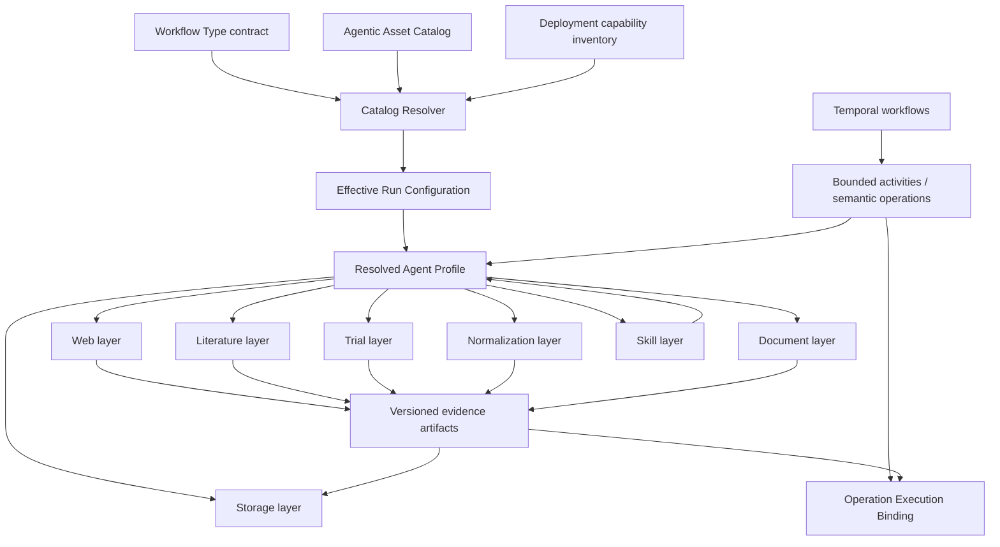
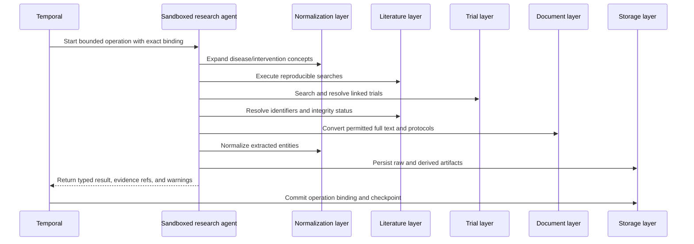

# Biotech Research Agent Capability Layers

Date: 2026-07-19

Status: Architecture proposal for research-ingestion-evaluation; aligned with the durable Agentic Asset Catalog proposal and intended for grill before acceptance as a domain decision

Related:

- [Durable Catalogs for Prompts, Agent Skills, and MCP Servers](../research/2026-07-18-prompt-skill-mcp-durable-catalogs-proposal.md)
- [CONTEXT.md](../CONTEXT.md) — Workflow Agentic Configuration Contract, Effective Run Configuration, Operation Execution Binding, Agent Profile, Execution Capability Profile, and Delegation Ceiling
- [OpenAI Agents SDK and Temporal notes](../BellLabs/openai-agents-sdk-and-temporal.md)
- [Agent tooling skill options](../BellLabs/agent-tooling-skill-options.md)

## Research Question

How should BellLabs organize the external services, MCP servers, deterministic executables, storage adapters, and Agent Skills needed by powerful sandboxed biotech research agents while preserving:

1. reproducible selection through durable catalog versions;
2. least-privilege authority through Workflow Type contracts and Execution Capability Profiles;
3. durable execution through Temporal rather than agent-owned scheduling;
4. shared application behavior behind FastAPI, MCP, CLI, and worker adapters;
5. claim-level provenance from a final research report back to source artifacts and exact tool bindings?

## Executive Verdict

Organize the research capability plane into seven composable layers:

1. **Web** — Tavily, Firecrawl, Exa, `agent-browser`, and Playwright
2. **Literature** — PubMed/PMC, Europe PMC, Crossref/Retraction Watch, Unpaywall, and BioC/PubTator
3. **Trials** — a project-owned ClinicalTrials.gov v2 adapter plus WHO ICTRP ingestion
4. **Normalization** — OLS MCP, MeSH, RxNorm, PubChem, UniProt, and Open Targets
5. **Documents** — a local Docling facade with OCR and LlamaParse escalation
6. **Storage** — read-only MongoDB and Neo4j profiles plus narrow S3 artifact tools
7. **Skills** — literature search, trial intelligence, entity normalization, evidence extraction, integrity verification, and grounded report generation

The layers are a **capability taxonomy and routing model**, not a new source of authority and not a replacement for the Agentic Asset Catalog.

- Prompts, Agent Skills, and MCP server recipes remain durable catalog assets.
- Workflow Type contracts declare which assets and deployment capabilities may be selected.
- Layer profiles compose those permitted references for a particular operation class.
- The Catalog Resolver resolves labels to exact versions at run admission.
- The Effective Run Configuration preserves the resolved set.
- Each Operation Execution Binding records what was actually exposed and used.
- Temporal owns durable sequencing, retries, waits, and recovery.
- Sandboxed agents may propose or author skills and executables, but authored content cannot grant itself authority.

## Relationship to the Durable Agentic Asset Catalog

The durable catalog proposal defines three catalog families:

```text
Prompt Catalog
Agent Skill Catalog
MCP Server Catalog
```

This proposal defines how those assets and non-catalog runtime capabilities are composed into scientific research operations:

```text
Capability Layer Profile
  ├── exact Prompt Catalog references
  ├── exact Agent Skill Catalog references
  ├── exact MCP Server Catalog references
  ├── permitted deterministic tool/executable identifiers
  ├── permitted data-source adapters
  ├── storage and workspace requirements
  └── routing, fallback, budget, and approval policy
```

### What belongs in each system

| Concern | System of record |
| --- | --- |
| Prompt bodies and templates | Prompt Catalog |
| `SKILL.md`, scripts, references, and skill bundles | Agent Skill Catalog plus content-addressed object storage |
| MCP connection recipes, credential references, tool filters, and schema snapshots | MCP Server Catalog |
| Allowed layers and assets for a Workflow Type | Workflow Agentic Configuration Contract |
| Exact resolved versions for one run | Effective Run Configuration |
| Exact tools, skills, prompts, models, MCP connections, and authority used by one operation | Operation Execution Binding |
| External sequencing, retries, timers, waits, and recovery | Temporal |
| API clients, parsing logic, normalization services, and domain behavior | Shared application-service layer |
| Runtime availability of browsers, binaries, network routes, and workers | Deployment/worker capability inventory |

Direct HTTP adapters and deterministic executables should not be disguised as MCP Server Catalog entries merely to make them durable. They are runtime tools referenced by stable tool identifiers and versioned deployment manifests. If BellLabs later needs first-class lifecycle management for these artifacts, the catalog may be extended with a reviewed `tool` or `executable` asset family. Until that decision is made, MCP recipes remain MCP assets and executables remain deployment capabilities.

### Authority invariant

Catalog presence and layer membership mean **available for consideration**, not **authorized for execution**.

Effective authority remains the intersection of:

```text
Workflow Type contract
∩ Effective Run Configuration
∩ actor/operation Execution Capability Profile
∩ Delegation Ceiling
∩ data and Permission Assessments
∩ current approval state
```

A Dynamic Instruction, web page, retrieved paper, MCP tool description, `SKILL.md`, or agent-authored executable cannot enlarge this intersection.

## Capability Plane



## Shared Layer Contract

Every layer should declare the same minimum control and observability fields even though its tools differ.

| Field | Purpose |
| --- | --- |
| `layer_id` / `layer_version` | Stable identity for the routing policy |
| `operation_classes` | Semantic operations permitted to use the layer |
| `required_assets` | Exact or resolvable Prompt, Skill, and MCP references |
| `optional_assets` | Degradable capabilities that may be unavailable |
| `tool_allowlist` | Maximum tools that may be exposed |
| `source_policy` | Permitted domains, APIs, datasets, and source classes |
| `credential_refs` | Secret-store references, never raw credentials |
| `network_policy` | Permitted destinations and transport requirements |
| `budget_dimensions` | Calls, pages, bytes, documents, tokens, time, and provider credits |
| `fallback_chain` | Ordered, policy-bounded escalation path |
| `approval_policy` | Calls or mutations requiring human or policy approval |
| `artifact_contract` | Required durable outputs and provenance |
| `quality_gates` | Validation required before outputs become admissible |
| `compatibility` | Runtime, worker, sandbox, SDK, and binary requirements |

Layer profiles should be versioned configuration referenced by the Workflow Agentic Configuration Contract. They may simplify composition but cannot override the underlying asset and capability ceilings.

## Layer 1 — Web

### Mission

Discover current public information, extract web-native content, inspect interactive sites, and retrieve source files when a structured domain API is absent or inadequate.

### Preferred capability routing

| Priority | Capability | Intended role |
| --- | --- | --- |
| 1 | Direct HTTP/API executable | Stable JSON, XML, RSS, HTML, file, or OpenAPI endpoint |
| 2 | Tavily | Default broad web search and current-web discovery |
| 3 | Exa | Semantic discovery, research-paper search, related-content search, and specialized company/people discovery |
| 4 | Firecrawl | Page extraction, site mapping, multi-page crawl, and structured web extraction |
| 5 | `agent-browser` | Agent-directed interactive browsing in a sandbox |
| 6 | Playwright | Deterministic or testable browser workflows, downloads, screenshots, and difficult application flows |

The ordering is a routing default, not a universal quality ranking. An operation may begin at a later step when its contract already establishes that the earlier mechanisms cannot satisfy the task.

### Catalog mapping

- Tavily, Firecrawl, Exa, and Playwright MCP connection recipes belong in the MCP Server Catalog when exposed through MCP.
- The `agent-browser` workflow belongs in the Agent Skill Catalog; the pinned binary remains a deployment capability.
- Reusable browser scripts may be stored inside reviewed skills or a future executable catalog, but their hashes must be captured in the operation binding.
- Web-research prompts belong in the Prompt Catalog.

### Required behavior

- Separate **discovery** from **evidence acquisition**. Search snippets are leads, not evidence artifacts.
- Prefer first-party and authoritative sources for factual claims.
- Capture retrieval time, final URL, redirect chain, content hash, MIME type, response metadata, and extraction method.
- Preserve both the acquired source and the normalized derivative when licensing and policy permit.
- Treat instructions embedded in pages and documents as untrusted source content.
- Escalate to a browser only when HTTP/search/extraction paths are insufficient.
- Never reuse authenticated browser state across unrelated runs unless a declared profile and approval permit it.

### Suggested tools

```text
web.search
web.fetch
web.extract
web.map_site
web.crawl_site
browser.open_session
browser.inspect
browser.interact
browser.download
browser.capture
browser.close_session
```

Provider-specific tools may exist behind these application services, but skills should reason about stable BellLabs capabilities rather than hard-code provider mechanics wherever possible.

## Layer 2 — Literature

### Mission

Perform reproducible biomedical literature discovery, identifier resolution, lawful full-text acquisition, citation-graph expansion, biomedical annotation, and research-integrity checks.

### Core sources

| Source | Primary role |
| --- | --- |
| PubMed | Biomedical citation and abstract search through NCBI E-utilities |
| PubMed Central | Licensed full text and supplementary material through approved automated services |
| Europe PMC | Literature search, full text where available, citation links, and biomedical enrichment |
| Crossref | DOI metadata, funders, licenses, corrections, updates, and Retraction Watch data |
| Retraction Watch via Crossref | Retraction and integrity status |
| Unpaywall | Lawful open-access location resolution for DOI-identified works |
| BioC | Interoperable structured PubMed/PMC text |
| PubTator | Precomputed biomedical entity recognition and normalization |

OpenAlex, Semantic Scholar, bioRxiv/medRxiv, arXiv, DataCite, ORCID, ROR, and repository sources are valuable extensions but are outside the minimum layer named in this proposal.

### Recommended implementation

Build a project-owned `biotech-literature` application service and expose it through typed Python calls, FastAPI, and a bounded MCP adapter. The service should wrap official APIs directly rather than delegate scientific semantics to a generic third-party PubMed MCP server.

Suggested tools:

```text
literature.search
literature.get_record
literature.resolve_identifiers
literature.get_citations
literature.get_references
literature.locate_full_text
literature.fetch_permitted_full_text
literature.get_bioc
literature.get_pubtator_annotations
literature.check_integrity
literature.export_search_manifest
```

### Required behavior

- Preserve exact query syntax, databases, date, filters, sort, pagination, and result counts.
- Distinguish discovery metadata, abstract text, repository full text, publisher full text, preprints, corrections, and retractions.
- Resolve and retain DOI, PMID, PMCID, preprint DOI, and repository identifiers without collapsing distinct versions.
- Use Crossref/Retraction Watch during integrity verification, not only during initial discovery.
- Consult Unpaywall or explicit license metadata before automated full-text acquisition.
- Preserve the source license and acquisition basis on every full-text artifact.
- Deduplicate conservatively and retain an auditable equivalence decision.
- Keep source passages and location anchors for extracted evidence.

### Artifact contract

At minimum, one literature discovery operation should emit:

- a search manifest;
- a raw result artifact or immutable response references;
- normalized citation records;
- identifier-resolution and deduplication decisions;
- integrity status;
- acquisition/license status;
- links to any full-text and BioC artifacts;
- warnings, partial failures, and provider timestamps.

## Layer 3 — Trials

### Mission

Create reliable clinical-trial intelligence across registries, record histories, publications, results, interventions, sponsors, sites, and regulatory evidence.

### Required sources

#### ClinicalTrials.gov v2

Use a project-owned typed adapter generated or validated against the official OpenAPI specification. The adapter should preserve raw study records, the API data timestamp, pagination state, source update timestamps, and the exact query.

#### WHO ICTRP

Use an ingestion workflow for authorized CSV/XML exports or another approved access mechanism. ICTRP provides broader registry coverage and bridges records from participating registries, but its terms, update cadence, and access mode differ from ClinicalTrials.gov and must be recorded explicitly.

### Why this layer must be custom

Trial intelligence requires domain operations that generic registry wrappers rarely supply:

- cross-registry identifier resolution;
- conservative duplicate detection;
- intervention and condition normalization;
- record-version comparison;
- registered-versus-published outcome comparison;
- sponsor and site normalization;
- publication and regulatory-document linkage;
- recruitment-landscape analysis;
- eligibility decomposition;
- historical timeline reconstruction.

### Suggested tools

```text
trials.search
trials.get_record
trials.get_history
trials.compare_versions
trials.resolve_identifiers
trials.find_duplicates
trials.find_publications
trials.find_regulatory_records
trials.normalize_conditions
trials.normalize_interventions
trials.extract_eligibility
trials.compare_registered_and_published_outcomes
trials.build_evidence_timeline
```

### Canonical trial record

The normalized record should cover:

- source registry, primary identifier, and secondary identifiers;
- registration and update history;
- sponsor and collaborators;
- study type, phase, design, arms, masking, and allocation;
- conditions and normalized ontology identifiers;
- interventions, ingredients, products, comparators, and normalized identifiers;
- eligibility criteria and structured population constraints;
- outcomes, measures, timeframes, and result status;
- enrollment and analysis populations;
- sites, countries, contacts, and geospatial data;
- recruitment status and dates;
- adverse events, protocols, statistical analysis plans, results, and IPD-sharing statements;
- linked publications, regulatory documents, and evidence artifacts;
- source-specific unmapped fields.

Normalization must not discard the raw record or silently assert equivalence. The system should represent exact, probable, possible, and rejected matches with evidence and method versions.

## Layer 4 — Normalization

### Mission

Turn names and free text into stable biomedical entities while preserving ambiguity, source vocabulary, mapping method, and version.

### Core capabilities

| Capability | Role |
| --- | --- |
| OLS MCP | Search ontology terms and traverse hierarchies through the official EMBL-EBI MCP service |
| MeSH | Biomedical subject-heading expansion and PubMed query support |
| RxNorm | Drug ingredient, strength, dose form, branded product, and RxCUI normalization |
| PubChem | Compound identity, structure, synonym, assay, bioactivity, and cross-reference normalization |
| UniProt | Protein accession, sequence, function, and cross-reference normalization |
| Open Targets | Target, disease, drug, evidence, and target-disease association context |

### Normalization is an evidence-producing operation

A normalized identifier is not merely a convenience field. Every mapping should record:

```text
input text/value
source context
candidate identifiers
selected identifier(s)
mapping relation
confidence or decision class
method/tool and exact version
ontology/database release when available
supporting evidence
review status
```

### Suggested tools

```text
normalize.disease
normalize.phenotype
normalize.drug
normalize.compound
normalize.gene
normalize.protein
normalize.variant
normalize.organization
normalize.trial_identifier
normalize.expand_query_terms
normalize.get_term_hierarchy
normalize.resolve_cross_references
```

### Boundary with Neo4j

The Normalization layer determines and records candidate mappings. The Storage layer persists accepted or review-pending entities and relationships. Direct graph writes do not become acceptable merely because the normalizer returned a candidate.

## Layer 5 — Documents

### Mission

Convert heterogeneous source documents into reproducible, inspectable artifact bundles suitable for extraction, retrieval, citation, and downstream graph construction.

### Routing policy

1. Use local Docling as the default document converter.
2. Use format-native deterministic extraction where it is more faithful.
3. Escalate scanned documents to local OCR.
4. Escalate difficult layouts to LlamaParse only when policy, data sensitivity, and budget permit external processing.
5. Preserve failures and partial outputs rather than silently substituting low-quality text.

The facade should support PDF, DOCX, PPTX, XLSX, HTML, plain text, images, and common structured scientific formats as requirements mature.

### Suggested tools

```text
documents.inspect
documents.convert
documents.ocr
documents.extract_tables
documents.extract_figures
documents.extract_references
documents.chunk
documents.validate_conversion
documents.get_artifact_manifest
```

### Canonical artifact bundle

```text
original artifact reference + SHA-256
detected MIME type and document class
canonical Markdown
structured document JSON
page/block coordinates
tables with structural cells
figures, images, and captions
references and resolved identifiers
section-aware chunks
parser/OCR provider, version, and configuration
quality metrics and extraction warnings
license, permission, and retrieval metadata
lineage among original and derived artifacts
```

Define named, versioned conversion and chunking profiles such as:

- `scientific-paper`
- `clinical-trial-protocol`
- `regulatory-document`
- `drug-label`
- `patent`
- `presentation`
- `spreadsheet-dataset`

These profiles belong in application configuration or a future durable tool/profile catalog. Agents may select only profiles permitted by their operation contract; they should not invent a new production chunking policy inside a run.

## Layer 6 — Storage

### Mission

Give research operations bounded access to durable run state, normalized graph knowledge, and immutable evidence artifacts without exposing universal database or cloud authority.

### MongoDB

Use the official MongoDB MCP server in read-only mode for bounded exploration and diagnostics. Production reads and writes should normally use project-owned typed repositories and application services so that validation, tenancy, lifecycle, idempotency, and audit behavior cannot be bypassed.

Recommended agent-facing capabilities:

```text
research_runs.get
research_runs.search
research_artifacts.list
research_evidence.query
catalog.resolve_read_only
```

Administrative Atlas tools and unrestricted CRUD should not be present in ordinary research profiles.

### Neo4j

Use schema-selected driver templates as the primary workflow for production graph operations. The official Neo4j MCP server may be exposed in read-only mode when an operation benefits from exploratory graph queries.

Recommended profiles:

- `neo4j-schema-read`
- `neo4j-evidence-read`
- `neo4j-proposed-write-plan`
- `neo4j-curated-write` — separate, approval-gated, and normally application-owned

Generated Cypher should be validated against the selected schema, query class, row/timeout limits, and write policy before execution.

### S3

Expose narrow artifact operations instead of a generic AWS API surface:

```text
artifacts.get
artifacts.put_derived
artifacts.list_for_run
artifacts.get_manifest
artifacts.create_presigned_download
artifacts.verify_hash
```

IAM should restrict bucket, prefix, action, encryption requirements, object size, and retention behavior. A research agent should not receive general S3 delete, bucket-policy, IAM, infrastructure, or unrelated-prefix access.

### Storage invariant

Storage tools persist evidence and state; they do not decide that evidence is scientifically valid. Admission to curated collections or graph assertions remains controlled by validation and workflow policy.

## Layer 7 — Agent Skills

### Mission

Encode reusable scientific procedures, routing logic, validation obligations, and reporting contracts independently from provider-specific API mechanics.

### Initial skill catalog

#### `biomedical-literature-search`

- Frame the research question.
- Expand concepts using MeSH and approved ontology sources.
- Construct reproducible source-specific queries.
- Search multiple permitted databases.
- export the complete search manifest.
- separate discovery, screening, acquisition, and synthesis.

#### `clinical-trial-intelligence`

- Search ClinicalTrials.gov and the available ICTRP corpus.
- Normalize conditions, interventions, sponsors, and sites.
- identify duplicates and linked records conservatively.
- compare histories, results, publications, and registry commitments.
- produce a trial evidence timeline and landscape tables.

#### `biomedical-entity-normalization`

- Route entity classes to the appropriate authoritative source.
- retain candidates and ambiguity.
- record mapping relations, evidence, source release, and method version.
- prohibit silent many-to-one collapse.

#### `evidence-extraction`

- Extract population, intervention/exposure, comparator, outcomes, design, effect estimates, uncertainty, adverse events, limitations, funding, and conflicts.
- attach every extracted assertion to source passages and location anchors.
- distinguish reported facts from agent inference.

#### `citation-and-integrity-verification`

- Resolve DOI/PMID/PMCID and version relationships.
- verify title, authors, venue, dates, and source identity.
- check corrections, expressions of concern, withdrawals, and retractions.
- distinguish preprint, accepted manuscript, repository copy, and version of record.
- prevent invalid or unsupported citations from entering grounded outputs.

#### `source-grounded-research-report`

- Build reports from admitted evidence artifacts rather than search snippets or memory.
- emit claim-level citations and evidence tables.
- identify contradictions, gaps, uncertainty, and source limitations.
- generate both human-readable output and a machine-readable claim/evidence graph.

### Skill composition

Skills may call across layers, but they do not own durable scheduling. For example:

```text
biomedical-literature-search
  -> Normalization layer for MeSH/ontology expansion
  -> Literature layer for database searches
  -> Document layer for eligible full text
  -> Storage layer for search and source artifacts
  -> citation-and-integrity-verification
  -> source-grounded-research-report
```

Temporal determines which of these are activities, their retry semantics, and whether a failure is required, degradable, or escalation-worthy.

### Catalog requirements

Every promoted skill version should retain:

- validated `SKILL.md` metadata and body;
- content-addressed bundle and file manifest;
- required capabilities and source layers;
- permitted operation classes;
- compatibility and dependency versions;
- test and evaluation evidence;
- safety and data-sensitivity review;
- exact content hash and change summary.

`allowed-tools` metadata is advisory. The Workflow Type contract and Execution Capability Profile remain authoritative.

## Cross-Layer Research Flow

An illustrative literature-to-trial evidence operation may proceed as follows:



The exact topology remains Workflow Type-owned. The diagram shows capability interaction, not permission for an agent to create its own durable workflow.

## Resolution Into Effective Run Configuration

At run admission:

1. Select the Workflow Type version and its Workflow Agentic Configuration Contract.
2. Validate requested layer profiles and Agent Profiles against that contract.
3. Resolve Prompt, Skill, and MCP labels to exact catalog versions.
4. Validate deterministic tool identifiers against the deployment capability inventory.
5. Validate network, secret, storage, browser, and workspace requirements.
6. Intersect all requested capabilities with the Execution Capability Profile and Delegation Ceiling.
7. Reserve multidimensional budgets for providers and tools.
8. Persist the exact resolved layer and asset set in the Effective Run Configuration.

No activity should resolve `latest`, `production`, or another floating label independently after run admission unless an authorized Run Control Revision creates a successor Effective Run Configuration.

## Operation Execution Binding

In addition to the catalog bindings defined by the durable catalog proposal, a research operation should preserve:

```text
layer profile ids and versions
provider and data-source identifiers
exact API/tool/executable versions
MCP server and allowed tool names
tool schema snapshot hashes
search queries, filters, pagination, and provider timestamps
network destination and endpoint fingerprints
secret reference ids, never secret values
browser/session profile identifiers when applicable
document conversion and chunking profiles
ontology/database releases when reported
input and output artifact hashes
license and permission decisions
quality-gate outcomes
retry attempts and fallback decisions
budgets reserved and consumed
```

This binding enables replay analysis even when an external source has changed. Replay may reproduce the transformation from retained source artifacts even when it cannot reproduce the historical external API response.

## Temporal and FastAPI Boundaries

### Temporal owns

- Workflow Run and linked-run lifecycle;
- durable stage and operation sequencing;
- retries, timers, waits, cancellation, and Continue-As-New;
- approval and escalation waits;
- checkpoint and compensation coordination;
- visibility into required versus degradable failure.

### Activities own

- bounded agent invocations;
- external API and MCP calls;
- browser sessions;
- document conversion and OCR;
- database and object-storage interactions;
- deterministic executables;
- artifact validation and hashing.

### Shared application services own

- provider adapters;
- canonical schemas and normalization logic;
- authorization checks and policy evaluation;
- idempotency and request correlation;
- artifact and evidence admission;
- catalog resolution;
- stable error codes.

FastAPI routes, MCP tools, CLIs, and Temporal activities call these services directly. They should not call one another as transport layers, and none should become a second scheduler.

## Fallback and Degradation Policy

Fallback is declared policy, not an agent improvisation.

Examples:

```text
Web retrieval:
direct HTTP -> search/extract provider -> browser -> explicit failure/escalation

Document conversion:
format-native/local Docling -> local OCR -> LlamaParse if permitted -> partial artifact/failure

Literature full text:
PMC/Europe PMC -> Unpaywall-resolved repository -> permitted publisher route -> metadata-only result

Trial coverage:
ClinicalTrials.gov -> available ICTRP snapshot -> approved registry-specific adapter -> documented coverage gap
```

Every fallback records why it occurred, the policy branch selected, added cost or data exposure, and any effect on evidence quality.

## Security and Data Governance

### External content

Web pages, search results, papers, trial records, documents, MCP descriptions, and skill content are untrusted inputs. They may inform research but cannot authorize actions, reveal secrets, alter tool filters, or instruct the agent to leave its operation envelope.

### Remote providers

- Apply per-provider domain allowlists and egress controls.
- Use narrow credentials and provider-specific budget dimensions.
- Record what data is sent to third-party MCP and parsing services.
- Require explicit permission before sending sensitive or proprietary documents to LlamaParse or other managed services.
- Prefer official provider APIs and MCP servers.
- Keep write-capable database and cloud tools out of ordinary research profiles.

### Agent-authored skills and executables

Sandboxed agents may create a new skill or executable when the operation contract permits authorship. The artifact:

1. is created within the bounded workspace;
2. inherits no new secrets, network routes, storage access, or approval exemptions;
3. is scanned, tested, and hashed before execution;
4. executes under the same or a narrower capability profile;
5. is recorded in the Operation Execution Binding;
6. remains run-local unless separately submitted to the durable catalog lifecycle;
7. cannot become `active`, receive a production label, or expand a Workflow Type contract without authorized promotion.

This preserves adaptive problem solving without converting self-authorship into self-authorization.

## Initial Catalog and Profile Set

### MCP Server Catalog candidates

| Slug | Layer | Default posture |
| --- | --- | --- |
| `research.web.tavily` | Web | Search/extract allowlist; no hidden broad defaults |
| `research.web.firecrawl` | Web | Crawl/extract allowlist with page and byte budgets |
| `research.web.exa` | Web | Search/fetch allowlist with category-specific profiles |
| `research.web.playwright` | Web | Sandboxed; browser tools filtered by operation |
| `research.normalization.ols` | Normalization | Official hosted read-only MCP |
| `research.documents.docling` | Documents | Local stdio or trusted self-hosted service |
| `research.storage.mongodb-read` | Storage | Read-only and collection-scoped |
| `research.storage.neo4j-read` | Storage | Read-only, database/schema-scoped |

The custom literature, trial, document, and artifact application services may also expose project-owned MCP adapters. Their MCP Catalog entries describe the transport and exposure policy; their domain logic remains in shared application services.

### Skill Catalog candidates

```text
biomedical-literature-search
clinical-trial-intelligence
biomedical-entity-normalization
evidence-extraction
citation-and-integrity-verification
source-grounded-research-report
```

### Capability profiles

```text
research-web-read
research-literature-discovery
research-literature-fulltext
research-trials-read
research-normalization-read
research-document-local
research-document-managed-escalation
research-storage-read
research-artifact-write
research-graph-curated-write
```

Profiles should be composable per operation. `research-artifact-write` means permission to write derived artifacts to an assigned run prefix, not universal S3 or database write access.

## Implementation Sequence

### Phase 0 — Vocabulary and contracts

- Add Capability Layer and Capability Layer Profile to `CONTEXT.md` after grill.
- Confirm whether layer profiles are embedded Workflow Type configuration or a distinct versioned configuration collection.
- Define the stable tool identifier convention for direct APIs and executables.

### Phase 1 — Web and literature foundation

- Catalog Tavily, Firecrawl, Exa, Playwright, and the `agent-browser` skill/binary pairing.
- Implement the `biotech-literature` service for PubMed/PMC, Europe PMC, Crossref, Unpaywall, BioC, and PubTator.
- Emit reproducible search manifests and integrity results.
- Bind one literature operation through Temporal and record the complete Operation Execution Binding.

### Phase 2 — Trials and normalization

- Implement and test the ClinicalTrials.gov v2 adapter.
- Build versioned WHO ICTRP snapshot ingestion with terms and source timestamps.
- Add official OLS MCP and direct MeSH, RxNorm, PubChem, UniProt, and Open Targets adapters.
- Establish canonical entity and trial mapping records.

### Phase 3 — Documents

- Implement the local Docling facade and canonical artifact manifest.
- Add OCR routing and conversion-quality gates.
- Add permissioned LlamaParse escalation.
- Define named conversion and chunking profile versions.

### Phase 4 — Storage profiles

- Add collection-scoped MongoDB read capabilities.
- Add schema-scoped Neo4j read capabilities and approval-gated curated writes.
- Add run-prefix-scoped S3 artifact tools.
- Validate idempotency, lineage, and artifact hash checks through Temporal retries.

### Phase 5 — Scientific skills and evaluations

- Publish the initial six skills as immutable catalog versions.
- Add task-specific evaluation suites for retrieval completeness, mapping precision, extraction grounding, citation validity, and report traceability.
- Promote labels only after evaluation and security review.

## Acceptance Criteria

- [ ] Every research operation uses one or more declared capability-layer profile versions.
- [ ] Every referenced Prompt, Skill, and MCP asset resolves through the Agentic Asset Catalog to an exact version.
- [ ] Direct API adapters and executables have stable identifiers and version fingerprints without being mislabeled as MCP assets.
- [ ] Layer profiles cannot enlarge Workflow Type contracts, Execution Capability Profiles, or Delegation Ceilings.
- [ ] Search operations emit reproducible search manifests.
- [ ] Full-text acquisition records license and permission basis.
- [ ] Trial records preserve source-specific raw data and normalized mappings.
- [ ] Entity normalization preserves candidates, ambiguity, method, and source version.
- [ ] Document conversion emits a canonical artifact bundle with quality warnings and lineage.
- [ ] MongoDB and Neo4j MCP access is read-only by default.
- [ ] S3 tools are restricted to assigned artifact prefixes and narrow actions.
- [ ] Every report claim can link to admitted evidence artifacts and source locations.
- [ ] Temporal remains the only durable scheduler.
- [ ] Agent-authored skills and executables cannot self-promote or self-grant authority.
- [ ] Replay and evaluation can recover exact catalog assets, tool bindings, input artifacts, and transformation versions.

## Open Questions for Grill

1. Should Capability Layer Profiles become a new durable configuration collection, or remain embedded and versioned inside Workflow Type contracts?
2. Do deterministic executables and direct API adapters require a fourth `tool` catalog family now, or are deployment manifests plus stable tool ids sufficient for the first implementation?
3. Should `biotech-literature`, `biotech-trials`, and `belllabs-document-ingestion` be separate project-owned MCP servers, or tool namespaces on one BellLabs research MCP facade backed by separate application services?
4. Which operations may use managed LlamaParse, and which data classifications categorically require local conversion?
5. What WHO ICTRP access and reuse modes fit the intended commercial and research uses?
6. Which graph writes can be admitted deterministically, and which always require human review?
7. Should browser state ever persist between runs, or only within one operation/run under a named authenticated-browser profile?
8. What evidence-quality thresholds block grounded report generation versus permit a report with explicit coverage gaps?
9. Which source/database release identifiers must be snapshotted locally for meaningful replay?
10. Can a run-local skill or executable be reused by a linked run before catalog promotion, and if so, what parent-child binding and review rules apply?

## References

- BellLabs — [Durable Catalogs for Prompts, Agent Skills, and MCP Servers](../research/2026-07-18-prompt-skill-mcp-durable-catalogs-proposal.md)
- OpenAI — [MCP and Connectors](https://developers.openai.com/api/docs/guides/tools-connectors-mcp)
- OpenAI Agents SDK — [MCP](https://openai.github.io/openai-agents-python/mcp/)
- Agent Skills — [Specification](https://agentskills.io/specification)
- Tavily — [MCP Server](https://docs.tavily.com/documentation/mcp)
- Firecrawl — [MCP Server](https://docs.firecrawl.dev/mcp)
- Exa — [MCP Server](https://github.com/exa-labs/exa-mcp-server)
- Vercel Labs — [`agent-browser`](https://github.com/vercel-labs/agent-browser)
- Microsoft — [Playwright MCP](https://github.com/microsoft/playwright-mcp)
- NCBI — [APIs](https://www.ncbi.nlm.nih.gov/home/develop/api/), [PMC developer resources](https://pmc.ncbi.nlm.nih.gov/tools/developers/), [BioC APIs](https://www.ncbi.nlm.nih.gov/research/bionlp/APIs/)
- ClinicalTrials.gov — [API](https://clinicaltrials.gov/data-about-studies/learn-about-api)
- WHO — [ICTRP downloads](https://www.who.int/tools/clinical-trials-registry-platform/network/who-data-set/downloading-records-from-the-ictrp-database)
- EMBL-EBI — [OLS MCP](https://www.ebi.ac.uk/ols4/mcp)
- NLM — [MeSH RDF](https://id.nlm.nih.gov/mesh/), [RxNorm APIs](https://lhncbc.nlm.nih.gov/RxNav/APIs/index.html)
- PubChem — [PUG REST](https://pubchem.ncbi.nlm.nih.gov/docs/pug-rest)
- Open Targets — [GraphQL API](https://platform-docs.opentargets.org/data-access/graphql-api)
- Docling — [MCP](https://docling-project.github.io/docling/usage/mcp/)
- MongoDB — [MCP Server tools](https://www.mongodb.com/docs/mcp-server/tools/)
- Neo4j — [Official MCP Server](https://github.com/neo4j/mcp)
