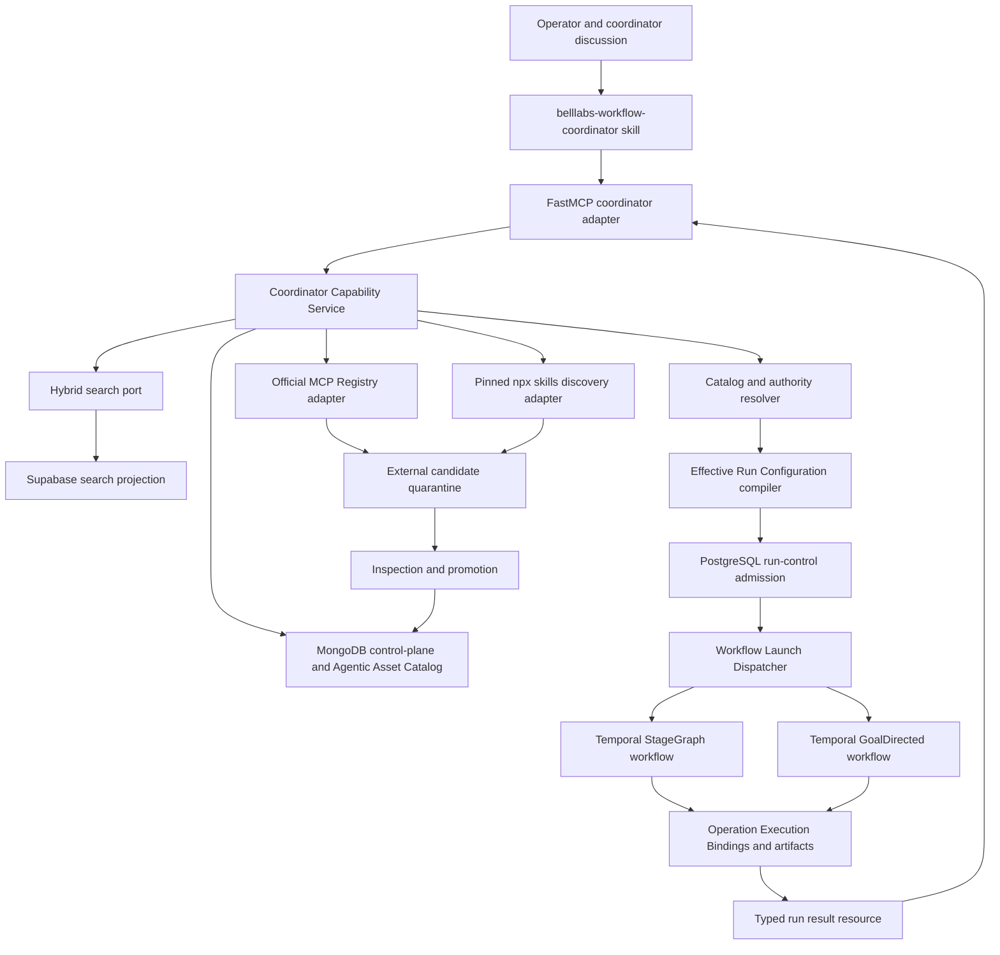

# Coordinator Capability Retrieval and Workflow Trigger Experiment

Date: 2026-07-25

Status: Accepted implementation specification for a close-to-production experiment; intended to become the canonical coordinator retrieval and launch surface after passing the acceptance gates in this document

Related:

- [Biotech Research Agent Capability Layers](../agent-capability-layers/2026-07-19-biotech-research-agent-capability-layers.md)
- [Durable Catalogs for Prompts, Agent Skills, and MCP Servers](2026-07-18-prompt-skill-mcp-durable-catalogs-proposal.md)
- [CONTEXT.md](../CONTEXT.md)
- [Durable Blueprint Orchestration and Linked Runs](../specs/pre-research/control-plane-foundations/03-durable-blueprint-orchestration-and-linked-runs.md)
- [Project organization](../../../biotech-research-ingestion-evaluation-system/.cursor/rules/project-organization.mdc)

## Research Question

How should BellLabs give a coordinator agent one efficient, governed surface through which it can:

1. understand a proposed workflow through discussion with an operator;
2. search internal Workflow Types, input contracts, prompts, Agent Skills, MCP servers, tools, and related resources;
3. discover external MCP servers through the official MCP Registry API;
4. discover external Agent Skills through `npx skills find <query>`;
5. construct or select a StageGraph or GoalDirected workflow design;
6. resolve the exact authorized assets and workspace needed for execution;
7. compile, admit, and actually trigger the workflow; and
8. receive a durable run handle and eventually retrieve a typed result?

## Executive Recommendation

Build a project-owned **Coordinator Capability Service** behind application ports, expose it through a small **FastMCP coordinator server**, and teach the coordinator how to use that server through one versioned **`belllabs-workflow-coordinator` Agent Skill**.

The experiment should be production-shaped in five ways:

1. **Reuse the current control plane.** Workflow Types, blueprints, profiles, exact references, Effective Run Configurations, admission, budgets, Operation Execution Bindings, Temporal orchestration, and workspaces remain authoritative. The MCP server is an adapter, not another control plane.
2. **Separate discovery from promotion and execution.** External MCP and skill search results are untrusted candidates. They cannot be attached to a run until inspected, validated, promoted into BellLabs' immutable catalog, and permitted by the selected Workflow Type and capability ceilings.
3. **Use hybrid search only as a read projection.** MongoDB remains the system of record for definitions and agentic assets. A Supabase/PostgreSQL full-text plus vector index may serve discovery, but every selected result is rehydrated from MongoDB and verified by exact digest before compilation.
4. **Support both executable blueprint families.** StageGraph remains the first and cheaper default for known static graphs. GoalDirected is also executable through the generic durable interpreter when bounded adaptive discovery or repair is required. The coordinator must select only an admitted exact blueprint; it cannot switch families after preparation.
5. **Require a prepare/launch boundary.** Search and drafting are read-only or draft-only. `prepare_workflow_launch` freezes exact references and returns a short-lived launch ticket. `launch_workflow` is separately authorized, idempotent, and accepts only that frozen ticket.

The canonical flow should be:

```text
operator discussion
  -> coordinator searches internal catalog
  -> coordinator optionally discovers external candidates
  -> coordinator selects an existing Workflow Type or submits a new design draft
  -> application resolver freezes exact authorized assets
  -> control plane compiles an Effective Run Configuration
  -> run-control admission accepts or rejects the Run Request
  -> the Workflow Launch Dispatcher selects the admitted blueprint family
  -> Temporal starts the exact StageGraph or GoalDirected workflow
  -> coordinator receives run identity and result resource
```

### Accepted implementation baseline

The following choices are locked for the first implementation. Changing one requires an explicit architecture decision and migration plan; it is not an implementation-time choice.

| Concern                        | Accepted choice                                                                                                                               |
| ------------------------------ | --------------------------------------------------------------------------------------------------------------------------------------------- |
| Authoritative catalog          | MongoDB immutable definitions and exact references                                                                                            |
| Search implementation          | Supabase/PostgreSQL hybrid full-text plus pgvector projection                                                                                 |
| Search authority               | None; every selected hit is rehydrated from MongoDB and digest-verified                                                                       |
| Search granularity             | One search row per MCP server, one per MCP tool, one per Agent Skill, prompt, Agent Profile, Workflow Type, and other supported catalog asset |
| MCP selection                  | Retrieve tools independently, group by parent server, freeze an explicit per-server tool allowlist                                            |
| Asset lifecycle                | Prompt, Skill, MCP Server, MCP Tool, and Agent Profile definitions join the existing control-plane `Definition` union                         |
| Projection synchronization     | MongoDB transactional projection outbox plus idempotent PostgreSQL projector                                                                  |
| Executable families            | StageGraph and GoalDirected                                                                                                                   |
| First end-to-end Workflow Type | `schema-context-selection`                                                                                                                    |
| Default family                 | StageGraph for known static graphs                                                                                                            |
| GoalDirected selection         | Bounded adaptive work with an initial goal, protected scope, independent verification, and convergence limits                               |
| Required web capability seed   | Firecrawl and Tavily MCP servers/tools and Agent Skills, plus promoted `vercel-labs/agent-browser` skill                                      |
| External discovery             | Candidate-only quarantine; promotion is required before selection                                                                             |
| Coordinator transport          | FastMCP over Streamable HTTP in deployment; in-memory client in tests                                                                         |
| Launch boundary                | Server-side prepared ticket, 15-minute default TTL, single-use and idempotent                                                                 |
| Initial result delivery        | Explicit polling through `get_workflow_result` and the run result resource                                                                    |

The experiment is complete only when Scenario A launches a real `schema-context-selection` StageGraph, Scenario C launches a real admitted GoalDirected implementation, and Scenario D proves catalog retrieval and exact binding of the required Firecrawl, Tavily, and `agent-browser` capabilities. A mocked launch, coordinator-only demonstration, or hard-coded capability selection does not satisfy the experiment.

## Findings From the Current Code

The experiment can extend substantial existing foundations rather than create a parallel prototype.

Primary implementation evidence:

- [control-plane definitions and blueprint contracts](../../../biotech-research-ingestion-evaluation-system/app/domain/control_plane/contracts.py)
- [operation, agent, prompt, skill, MCP, workspace, and delegation bindings](../../../biotech-research-ingestion-evaluation-system/app/domain/operation_execution/contracts.py)
- [MongoDB definition repository](../../../biotech-research-ingestion-evaluation-system/app/application/control_plane_repository.py)
- [Application Settings and project `.env` loading](../../../biotech-research-ingestion-evaluation-system/app/config.py)
- [OpenAI Agents SDK runtime mapping](../../../biotech-research-ingestion-evaluation-system/app/integrations/openai_agents_runtime.py)
- [StageGraph launch service](../../../biotech-research-ingestion-evaluation-system/app/application/orchestration.py)
- [Temporal StageGraph workflow](../../../biotech-research-ingestion-evaluation-system/app/temporal/stagegraph_workflow.py)
- [GoalDirected interpreter](../../../biotech-research-ingestion-evaluation-system/app/domain/orchestration/goal_directed.py)
- [GoalDirected runtime contracts](../../../biotech-research-ingestion-evaluation-system/app/domain/orchestration/contracts.py)
- [Temporal GoalDirected workflow](../../../biotech-research-ingestion-evaluation-system/app/temporal/goal_directed_workflow.py)
- [GoalDirected Temporal activities and worker](../../../biotech-research-ingestion-evaluation-system/app/temporal/goal_directed_activities.py)
- [GoalDirected interpreter tests](../../../biotech-research-ingestion-evaluation-system/tests/test_goal_directed_interpreter.py)
- [GoalDirected Temporal and replay tests](../../../biotech-research-ingestion-evaluation-system/tests/test_goal_directed_temporal.py)
- [FastAPI control-plane adapter](../../../biotech-research-ingestion-evaluation-system/app/api/control_plane.py)
- [FastAPI run-control adapter](../../../biotech-research-ingestion-evaluation-system/app/api/run_control.py)

### Already present

- `DefinitionKind` already reserves:
  - `workflow_type`
  - `agent_profile`
  - `prompt`
  - `skill`
  - `mcp_server`
  - `mcp_tool`
  - `plugin_package`
- Workflow Type definitions already declare purpose, input admission contract, invariants, obligations, output contracts, allowed blueprints and profiles, authority ceiling, workspace contract, and linked-run slots.
- StageGraph and GoalDirected are the only accepted top-level blueprint families.
- Exact definitions use revision plus SHA-256 digest.
- Published definitions and aliases are stored in MongoDB through Beanie.
- Effective Run Configurations are compiled and stored immutably.
- PostgreSQL run-control admission binds exact Workflow Type and Effective Run Configuration references.
- Operation Execution Requests and Bindings already freeze:
  - prompt sources and rendered digests;
  - model policy;
  - tools and schema digests;
  - MCP server endpoints, allowed tools, schema digests, and approval policy;
  - immutable skills and mount paths;
  - Agent Profile;
  - capability grant and delegation ceiling;
  - workspace and network policy;
  - budgets, secrets by reference, and tracing/policy references.
- The OpenAI Agents SDK adapter already:
  - enforces MCP endpoint host allowlists;
  - applies a static MCP tool allowlist;
  - resolves approval policy before runtime;
  - verifies skill content digests before mounting;
  - materializes skills into sandbox manifests;
  - prevents delegated agents from exceeding intersected authority.
- Deterministic Temporal StageGraph and GoalDirected interpreters and launch services already exist.
- `WorkflowLaunchDispatcher` selects the runtime strictly from the exact admitted blueprint family.
- GoalDirected execution freezes a concrete initial goal and protected-scope digest, then performs bounded sequential iterations with stable retry identities, budget accounting, protected Goal Revisions, configured session rollover, typed handoffs, immutable checkpoints, independent verification, deterministic stop precedence, and typed terminal results.

### Deliberate gaps this experiment should fill

Although the asset kinds are reserved, `prompt`, `skill`, `mcp_server`, `mcp_tool`, and `agent_profile` are not yet members of the publishable `Definition` union. The existing API therefore cannot yet publish them as first-class definitions.

The definition repository supports exact retrieval and alias resolution but not catalog search, faceting, or compatibility-aware ranking.

The FastAPI control-plane API can publish and compile definitions, and the run-control API can admit and execute bounded operations, but there is no single coordinator-oriented application service that performs:

```text
search -> retrieve contract -> resolve assets -> prepare launch -> admit -> start
```

The runtime currently injects a bound skill's `SKILL.md` content into instructions in addition to mounting it. The experiment should move toward progressive disclosure: provide the skill's name, description, exact reference, and path up front, then let the agent read the full skill only when selected.

## Semantic Boundaries

The coordinator will be powerful only if these categories remain distinct.

| Category                     | Meaning                                              | Authority                                            |
| ---------------------------- | ---------------------------------------------------- | ---------------------------------------------------- |
| Internal catalog asset       | Reviewed immutable BellLabs version                  | Available for policy-bounded selection               |
| External discovery candidate | Untrusted upstream metadata or bundle                | No execution authority                               |
| Workflow Type                | Reusable semantic workflow contract                  | Defines what a run may mean and accept               |
| Blueprint                    | Frozen StageGraph or GoalDirected execution shape    | Interpreted only after admission                     |
| Prompt                       | Versioned instruction content or template            | Cannot enlarge authority                             |
| Agent Skill                  | Versioned procedure, scripts, references, and assets | Cannot grant tools, network, secrets, or write scope |
| MCP server recipe            | Connection and exposure policy, not a live socket    | Instantiated only by trusted runtime                 |
| MCP resource                 | Application-controlled contextual data               | Readable only within caller scope                    |
| MCP prompt                   | User-selected interaction template                   | Convenience view over the Prompt Catalog             |
| MCP tool                     | Model-callable operation                             | Authorized and audited separately                    |
| Search result                | Ranked retrieval evidence                            | Never sufficient for launch                          |
| Launch ticket                | Frozen, expiring, caller-bound execution proposal    | Required input to the mutation boundary              |

The MCP specification describes prompts as user-controlled, resources as application-controlled, and tools as model-controlled. The coordinator server should preserve that interaction model rather than represent every concern as an executable tool.

## Proposed Architecture



### Shared application services

The core implementation belongs under the existing application's domain and application layers using the normative file map in [Implementation Sequence](#implementation-sequence). FastMCP, FastAPI routes, Temporal activities, and CLIs call the same application services directly. The MCP adapter must not call BellLabs' FastAPI routes over HTTP, and FastAPI must not call the MCP adapter.

The currently reserved `biotech-mcp/` folder should remain available for packaging or deploying system-wide MCP servers later. For the experiment, domain behavior should stay in the main application so that later extraction does not create a second source of truth.

## Storage and Search Decision

### Authority

Keep MongoDB as the authority for:

- catalog asset identity and immutable versions;
- Workflow Types and blueprints;
- Agent Profiles;
- prompts, skills, MCP recipes, and tool snapshots;
- alias movement history;
- external candidate inspection records;
- Effective Run Configuration payloads;
- detailed workflow and operation documents.

Keep PostgreSQL as the authority for:

- Run Request admission;
- Workflow Run lifecycle;
- budgets;
- links and dependency decisions;
- idempotent launch state;
- outbox events.

Keep object storage as the authority for:

- skill bundle archives;
- raw external discovery responses;
- fetched repositories and manifests;
- MCP schema snapshots;
- large prompt attachments;
- immutable run artifacts.

### Search projection

Use a `CatalogSearchPort` so storage choice does not leak into coordinator logic.

For the first experiment, Supabase/PostgreSQL is the canonical discovery projection because the workspace already carries Supabase configuration and the official Supabase pattern combines:

- a generated `tsvector`;
- a GIN index for full-text search;
- a pgvector HNSW index;
- Reciprocal Rank Fusion of lexical and semantic ranks.

The projection is disposable and rebuildable. It stores no secrets, prompt bodies, skill archives, credentials, or executable code and does not become an execution authority.

Add PostgreSQL migration `app/migrations/0005_capability_search.sql`. The implementation may adapt SQL types to existing migration conventions, but it must preserve these constraints:

```sql
create schema if not exists extensions;
create extension if not exists vector with schema extensions;

create table capability_search_documents (
    search_document_id uuid primary key,
    tenant_scope text not null,
    asset_kind text not null,
    logical_id text not null,
    revision integer not null,
    source_digest text not null,
    status text not null,
    title text not null,
    description text not null,
    search_text text not null,
    fts tsvector generated always as (
        setweight(to_tsvector('english', coalesce(title, '')), 'A') ||
        setweight(to_tsvector('english', coalesce(logical_id, '')), 'A') ||
        setweight(to_tsvector('english', coalesce(search_text, '')), 'B') ||
        setweight(to_tsvector('english', coalesce(description, '')), 'C')
    ) stored,
    embedding extensions.vector(1536) not null,
    embedding_model_id text not null,
    search_document_format_version integer not null,
    parent_kind text,
    parent_logical_id text,
    parent_revision integer,
    mongodb_collection text not null,
    mongodb_document_id text not null,
    tags text[] not null default '{}',
    domains text[] not null default '{}',
    operation_classes text[] not null default '{}',
    workflow_type_refs jsonb not null default '[]',
    capability_requirements jsonb not null default '[]',
    compatibility jsonb not null default '{}',
    source_published_at timestamptz not null,
    indexed_at timestamptz not null default now(),
    unique (tenant_scope, asset_kind, logical_id, revision, source_digest)
);

create index capability_search_documents_fts_idx
    on capability_search_documents using gin (fts);

create index capability_search_documents_embedding_idx
    on capability_search_documents
    using hnsw (embedding vector_cosine_ops);

create index capability_search_documents_identity_idx
    on capability_search_documents
    (tenant_scope, asset_kind, logical_id, revision);

create index capability_search_documents_parent_idx
    on capability_search_documents
    (tenant_scope, parent_kind, parent_logical_id, parent_revision);
```

Version 1 uses OpenAI `text-embedding-3-small` with its 1,536-dimension default and records the exact provider/model identifier in every row. Configure it with `CAPABILITY_EMBEDDING_MODEL=text-embedding-3-small`.

The projector obtains `OPENAI_API_KEY` through the existing `app.config.Settings.openai_api_key` `SecretStr`, which already loads the project-root `.env`. Projector code must not parse or print the `.env` file itself. The key is used only to authenticate embedding requests and is never stored in MongoDB, PostgreSQL, projection events, search documents, digests, logs, traces, or artifacts. Startup and projector preflight report only whether the required credential reference is available. Missing credentials fail projection work with a sanitized, retryable dependency error.

Embedding requests are batched and retry-safe. Persist an embedding only after verifying that its model, dimensions, search-document format version, and source digest match the claimed projection event. A dimension or model change creates a new projection generation and index migration rather than mixing incompatible embeddings in this table.

`search_text` is a deterministic materialization, not free-form editorial copy. Its version-1 renderer concatenates normalized, labeled sections in this order:

```text
title
logical identifier and aliases
asset kind
short description
intended uses
non-goals
input summary
output summary
capability and authority summary
compatibility summary
tags and domains
parent server identity, for MCP tools
tool names, for MCP server summary rows
```

The renderer returns both `search_text` and `search_document_format_version = 1`. The source definition digest, renderer version, and embedding model uniquely determine whether a row needs re-embedding.

Use lexical search to reward exact identifiers, tool names, biomedical terms, and contract vocabulary. Use vector search to find semantically related procedures and workflows. Retrieve up to `2 * limit` candidates from each branch, rank each branch independently, and fuse them with Reciprocal Rank Fusion using `rrf_k = 50`. Default lexical and semantic weights are both `1.0`. Apply tenant, lifecycle, kind, and caller-visibility filters before returning hits.

MongoDB Vector Search may later implement a second `CatalogSearchPort` adapter for a measured comparison. It does not replace this accepted projection without evaluation evidence and a new architecture decision. Do not purchase MongoDB Flex or delay this slice solely for vector search.

### MCP server and tool projection rules

MCP servers and MCP tools are independently searchable assets:

- An MCP Server row describes the server's overall provider, trust, transport, domains, operational purpose, and summarized tool inventory.
- Every MCP Tool receives its own row with `asset_kind = "mcp_tool"` and a populated parent server reference.
- A tool row's embedding describes only that tool's purpose, inputs, outputs, side-effect class, approval needs, and parent server identity. It must not contain the concatenated descriptions of sibling tools.
- Tool search results are grouped by exact parent MCP Server version after ranking.
- Grouping does not discard individual scores or policy reasons.
- Selection freezes `server_ref` plus an explicit set of exact `tool_refs` and tool names. Selecting a server never implicitly selects every tool it exposes.
- If a selected tool's schema digest differs from the promoted snapshot, launch preparation fails with `CAPABILITY_SCHEMA_CHANGED`.

Agent Skills use one search row per promoted skill version. Large skills may add non-selectable chunk rows later for explanatory retrieval, but only the root `skill` row can be selected for execution.

### Required seeded web capability catalog

The experiment must promote and persist the following reviewed capability set. “Promote” means create immutable MongoDB definitions first and then materialize their PostgreSQL search rows through the normal projection outbox. Local installation or Codex configuration alone is not catalog authority.

#### MCP servers and tools

| Mongo logical ID | Local/upstream identity | Required promotion behavior |
| --- | --- | --- |
| `mcp.firecrawl` | Local Codex MCP identity `firecrawl`; upstream package/remote identity captured during inspection | Publish one `MCPServerDefinition`, probe `tools/list` in quarantine, and publish one exact `MCPToolDefinition` for every returned tool |
| `mcp.tavily` | Local Codex MCP identity `tavily-remote-mcp`; sanitized endpoint identity `https://mcp.tavily.com/mcp/` | Publish one `MCPServerDefinition`, probe `tools/list` in quarantine, and publish one exact `MCPToolDefinition` for every returned tool |

The first fixture requires at least these independently searchable tool rows:

```text
mcp.firecrawl:firecrawl_search
mcp.firecrawl:firecrawl_scrape
mcp.firecrawl:firecrawl_interact
mcp.tavily:tavily_search
mcp.tavily:tavily_extract
mcp.tavily:tavily_map
mcp.tavily:tavily_crawl
```

These names are minimum fixture expectations, not permission to substitute assumed schemas. Promotion uses the names and schemas returned by the inspected server, freezes their schema digests, and fails visibly if a minimum expected capability is absent. Endpoint URLs containing credentials, authorization headers, and provider API-key values are never copied into catalog definitions; definitions contain credential references only.

#### Agent Skills

Promote the locally available Firecrawl and Tavily skill bundles as independent immutable `SkillDefinition` versions:

```text
Firecrawl
  firecrawl
  firecrawl-agent
  firecrawl-crawl
  firecrawl-download
  firecrawl-interact
  firecrawl-map
  firecrawl-monitor
  firecrawl-parse
  firecrawl-scrape
  firecrawl-search

Tavily
  tavily-best-practices
  tavily-cli
  tavily-crawl
  tavily-dynamic-search
  tavily-extract
  tavily-map
  tavily-research
  tavily-search
```

Each skill version records its exact source path or upstream locator, complete file manifest, bundle digest, parsed frontmatter, required runtime capabilities, network needs, executable scripts, review evidence, and provenance. PostgreSQL receives one selectable root row per promoted skill version.

Also discover, inspect, pin, and promote:

```text
source repository: vercel-labs/agent-browser
skill name: agent-browser
upstream path: skills/agent-browser/SKILL.md
discovery/install identity: vercel-labs/agent-browser
Mongo logical ID: skill.agent-browser
```

The `agent-browser` skill is first recorded as an external candidate, then promoted from an exact upstream commit and bundle digest. The ordinary workflow never executes `npx skills add`; it mounts the promoted immutable bundle.

An Agent Skill does not grant browser authority. Selecting `skill.agent-browser` additionally requires an Agent Profile/runtime binding that explicitly permits the pinned `agent-browser` executable, browser process creation, approved network destinations, workspace paths, screenshots/artifacts, and any required sandbox capability. Launch preparation must report the skill as incompatible rather than silently granting those capabilities when the runtime binding is absent.

#### Search-document requirements

The seeded rows must use descriptions and tags that make these distinctions searchable:

```text
web search and current-information retrieval
web page extraction and scraping
site mapping and crawling
interactive browser navigation
clicking and form filling
screenshots and visual verification
structured research with cited sources
MCP tool authority versus Agent Skill procedure
```

Search results must preserve provider identity. Firecrawl and Tavily may both satisfy `web.search`, but they remain separate ranked results with separate exact server/tool and skill references.

### Projection consistency

Avoid a best-effort dual write.

1. In the same MongoDB transaction that publishes an immutable definition, insert a `CatalogProjectionEvent` into the `catalog_projection_events` collection.
2. The event identity is deterministic: `sha256(tenant_scope + kind + logical_id + revision + digest + operation)`.
3. A projector claims unprocessed events with a lease, renders the deterministic search document, obtains the embedding, and upserts PostgreSQL by `(tenant_scope, asset_kind, logical_id, revision, source_digest)`.
4. The projector records attempt count, last error, next attempt time, and terminal poison status in MongoDB. Retries are exponential and bounded; poison events generate an operational alert.
5. After the PostgreSQL commit, the projector marks the Mongo event completed. Reprocessing is safe because the PostgreSQL upsert is idempotent.
6. Retirement or revocation emits a new event that updates visibility/status; immutable historical rows may remain for audit but are excluded from ordinary search.
7. Search results expose `indexed_at`, `source_digest`, and projection generation.
8. Selection re-reads the exact Mongo version and verifies its digest, status, tenant visibility, and current policy eligibility.
9. A missing or stale projection may reduce discoverability, but it cannot change authorization or cause the wrong version to execute.

Provide two administrative commands from the start:

```text
rebuild_capability_search_projection --tenant <scope> [--kind <kind>]
verify_capability_search_projection --tenant <scope> [--repair]
```

Neither command deletes authoritative MongoDB definitions. Rebuild writes a new projection generation, verifies counts and digests, then activates that generation.

## Domain Contracts to Add

### Publishable catalog definitions

Promote the reserved definition kinds into explicit discriminated contracts rather than use arbitrary extension payloads for their core semantics.

Minimum first versions:

```text
PromptDefinition
  logical_id, title, description
  format
  template_engine
  variables
  body or payload_ref
  trust_class
  eval_refs

SkillDefinition
  logical_id, title, description
  skill_name
  frontmatter
  body_summary
  bundle_ref
  manifest_digest
  file_manifest
  required_capabilities
  compatibility
  source_provenance
  review_status

MCPServerDefinition
  logical_id, title, description
  transport
  endpoint or launch template
  credential_refs
  allowed_tools
  approval_policy
  network requirements
  schema_snapshot_ref
  schema_digest
  source_provenance
  review_status

MCPToolDefinition
  server_ref
  tool_name
  description
  input_schema
  output_schema
  annotations
  schema_digest

AgentProfileDefinition
  prompt_refs
  skill_refs
  mcp_server_refs
  tool_refs
  model policy
  guardrail refs
  output schema ref
  maximum capability request
```

These definitions join the existing `Definition` union in Phase 1. Each type must have validators, canonical serialization, digest generation, publication rules, schema export, exact retrieval, and alias tests before its API publication route is enabled. Do not introduce a sibling asset lifecycle for the first implementation.

### External candidate

An external result must not masquerade as an internal asset:

```text
ExternalDiscoveryCandidate
  candidate_id
  source: mcp_registry | npx_skills | skills_search_api | git
  upstream_identity
  upstream_version
  locator
  publisher
  discovered_at
  query
  raw_response_ref
  raw_response_digest
  upstream_status
  trust_tier
  inspection_status
  inspection_findings
  requested_capabilities
  license_evidence
  promoted_ref?
```

### Search request and result

```text
CapabilitySearchRequest
  query
  kinds[]
  tenant_scope
  workflow_type_ref?
  operation_class?
  required_capabilities?
  runtime?
  status_filter
  include_external_candidates = false
  limit

CapabilitySearchHit
  exact_ref or candidate_id
  kind
  title
  summary
  lexical_rank?
  semantic_rank?
  fused_rank
  compatibility_summary
  authorization_state:
    selectable | candidate_only | incompatible | forbidden | unavailable
  reasons[]
```

Return separate rank components and policy reasons. A high semantic score must never hide an authority failure.

### Workflow design draft

The coordinator may propose a novel design, but proposal is not publication:

```text
WorkflowDesignDraft
  draft_id
  purpose
  proposed_workflow_type
  blueprint_family
  proposed_stage_graph?      # only for StageGraph
  proposed_objective?        # only for GoalDirected
  proposed_acceptance?       # only for GoalDirected
  input_contract
  invariants
  obligations
  output_contracts
  linked_run_slots
  requested_assets
  requested_authority
  workspace_requirements
  budgets
  rationale
  validation_findings
```

An existing accepted Workflow Type can proceed to launch preparation. A novel design remains a draft until an authorized publisher creates and promotes the required exact definitions.

### Launch proposal and ticket

```text
WorkflowLaunchProposal
  request_scope
  workflow_type_selector
  implementation_selector?
  initial_goal?              # required only for GoalDirected
  input_manifest
  requested_overlays
  selected_asset_requests
  parent_constraints?
  approvals
  idempotency_issuer
  idempotency_key

PreparedLaunchTicket
  ticket_id
  caller_id
  tenant_scope
  request_scope
  state: prepared | consumed | expired | invalidated
  prepared_at
  expires_at
  proposal_digest
  workflow_type_ref
  blueprint_family
  initial_goal?              # server-side only; present only for GoalDirected
  initial_goal_digest?       # present only for GoalDirected
  effective_configuration_digest
  run_request_digest
  resolved_asset_refs
  authority_decisions
  availability_decisions
  approval_refs
  policy_snapshot_digest
  environment_snapshot_digest
  warnings
  launchable
  consumed_run_id?
```

The ticket is stored server-side in PostgreSQL and defaults to a 15-minute TTL. It is bound to caller, tenant, request scope, proposal digest, approvals, policy snapshot, and environment snapshot. It is single-use, but repeated launch calls with the same valid idempotency identity return the already-created run.

Preparation must invalidate or refuse a ticket when a selected asset is revoked, an approval expires, the caller or tenant differs, a required deployment or secret reference becomes unavailable, or a relevant policy/environment snapshot changes. Alias movement alone does not invalidate a ticket because preparation has already frozen exact references. The MCP response contains no secrets and cannot be edited to substitute another Workflow Type, configuration, or asset.

`initial_goal` is required when the selected exact blueprint family is GoalDirected and forbidden for StageGraph. Preparation validates that it is non-empty and freezes both the server-side value and its digest in the ticket. The value is never returned in the ordinary ticket response or written to audit logs. After admission creates the concrete run identity, `WorkflowLaunchDispatcher` passes the frozen value to `GoalDirectedLaunchService`, which constructs the initial Goal Revision and protected-scope digest from the admitted configuration. The model cannot provide or replace those runtime digests.

Migration `app/migrations/0006_coordinator_launch_tickets.sql` must provide the equivalent of:

```sql
create table coordinator_launch_tickets (
    ticket_id uuid primary key,
    tenant_scope text not null,
    caller_id text not null,
    request_scope text not null,
    state text not null check (
        state in ('prepared', 'consumed', 'expired', 'invalidated')
    ),
    prepared_at timestamptz not null,
    expires_at timestamptz not null,
    proposal_digest text not null,
    workflow_type_ref jsonb not null,
    blueprint_family text not null check (
        blueprint_family in ('StageGraph', 'GoalDirected')
    ),
    initial_goal text,
    initial_goal_digest text,
    effective_configuration_digest text not null,
    run_request_digest text not null,
    resolved_asset_refs jsonb not null,
    authority_decisions jsonb not null,
    availability_decisions jsonb not null,
    approval_refs jsonb not null,
    policy_snapshot_digest text not null,
    environment_snapshot_digest text not null,
    warnings jsonb not null default '[]',
    launchable boolean not null,
    idempotency_issuer text not null,
    idempotency_key text not null,
    consumed_run_id uuid,
    consumed_at timestamptz,
    invalidation_reason text,
    unique (
        tenant_scope,
        caller_id,
        idempotency_issuer,
        idempotency_key
    ),
    check (
        (
            blueprint_family = 'StageGraph'
            and initial_goal is null
            and initial_goal_digest is null
        )
        or
        (
            blueprint_family = 'GoalDirected'
            and initial_goal is not null
            and length(trim(initial_goal)) > 0
            and initial_goal_digest is not null
        )
    )
);

create index coordinator_launch_tickets_expiry_idx
    on coordinator_launch_tickets (state, expires_at);
```

The repository performs compare-and-set transitions. Only `prepared -> consumed`, `prepared -> expired`, and `prepared -> invalidated` are valid. Launch creates or resolves the Workflow Run and records `consumed_run_id` within the existing PostgreSQL transaction boundary. If the existing run-control schema requires a different foreign-key type, the migration uses that type rather than weakening the relationship.

## FastMCP Coordinator Surface

Keep the always-visible surface small. Search exposes detail on demand.

### Tools

| Tool                         | Mutation                  | Purpose                                                                                                                                    |
| ---------------------------- | ------------------------- | ------------------------------------------------------------------------------------------------------------------------------------------ |
| `coordinator_bootstrap`      | No                        | Return server schema version, supported blueprint families, current executable families, resource templates, and recommended tool sequence |
| `search_capabilities`        | No                        | Hybrid-search internal Workflow Types, prompts, skills, MCP servers, tools, and Agent Profiles                                             |
| `get_capability`             | No                        | Retrieve one exact internal asset or inspected external candidate                                                                          |
| `discover_mcp_servers`       | No                        | Query the official MCP Registry and record untrusted candidates                                                                            |
| `discover_agent_skills`      | No                        | Run the bounded `npx skills find <query>` adapter and record untrusted candidates                                                          |
| `inspect_external_candidate` | Creates inspection record | Fetch, validate, scan, and summarize a candidate; never install it into an agent environment                                               |
| `validate_workflow_design`   | Draft only                | Validate a proposed StageGraph or GoalDirected draft and identify missing contracts/assets                                                 |
| `prepare_workflow_launch`    | Creates frozen ticket     | Resolve exact definitions, check availability/authority, compile ERC, and perform admission preview                                        |
| `launch_workflow`            | Yes                       | Admit and start only the exact prepared ticket, with caller authorization and idempotency                                                  |
| `get_workflow_result`        | No                        | Return run phase and exact typed result/artifact references when available                                                                 |

`launch_workflow` should be separately tagged and protected as a consequential action. External candidate discovery, inspection, and even internal catalog presence do not make an item eligible for the launch ticket.

### Resources

Use resource templates for application-controlled exact context:

```text
belllabs://workflow-types/{logical_id}/{revision}/contract
belllabs://workflow-types/{logical_id}/{revision}/input-schema
belllabs://workflow-types/{logical_id}/{revision}/output-contracts
belllabs://catalog/{kind}/{logical_id}/{revision}
belllabs://catalog/{kind}/{logical_id}/{revision}/manifest
belllabs://runs/{run_id}/launch
belllabs://runs/{run_id}/result
belllabs://runs/{run_id}/bindings
```

Resource responses should be size-bounded and may link to additional immutable resources rather than inline large bundles.

### Prompts

Expose a small user-controlled prompt set as exact Prompt Catalog views:

```text
propose_workflow
review_workflow_design
explain_launch_blocker
summarize_workflow_result
```

MCP prompts are not a second prompt registry. Each prompt response records the exact Prompt Definition reference and rendered digest.

Some coordinator clients import only MCP tools. For compatibility, use narrow tool equivalents or FastMCP's prompt/resource-to-tool transforms on a dedicated read-only server view. Do not expose generic arbitrary URI reading or arbitrary prompt rendering.

### FastMCP implementation rules

- Use Streamable HTTP for the deployed server; keep in-memory clients for tests.
- Mount the MCP ASGI application into the existing FastAPI deployment only if lifespans and authentication are explicitly combined.
- Authenticate every HTTP session.
- Derive tenant and actor scope from verified identity, never from model-supplied arguments alone.
- Apply per-component authorization and visibility before search results are returned.
- Add request size, result size, timeout, rate, and concurrency limits.
- Emit structured audit events for searches, candidate inspection, ticket preparation, launch, and result access.
- Return stable error codes with human-readable explanations.
- Pin the FastMCP major/minor range and test protocol behavior before upgrades.
- Do not use FastMCP's tool-search transform as the domain catalog. It can reduce MCP tool-schema loading, but BellLabs capability search still needs lifecycle, compatibility, authority, and exact-reference semantics.

All tools return a stable envelope:

```text
ok
schema_version
correlation_id
data?
error?
  code
  message
  retryable
  details
```

Initial stable error codes:

```text
INVALID_ARGUMENT
UNAUTHENTICATED
FORBIDDEN
NOT_FOUND
CONFLICT
RATE_LIMITED
DEPENDENCY_UNAVAILABLE
PROJECTION_STALE
CAPABILITY_NOT_SELECTABLE
CAPABILITY_SCHEMA_CHANGED
WORKFLOW_TYPE_NOT_EXECUTABLE
BLUEPRINT_FAMILY_MISMATCH
INITIAL_GOAL_REQUIRED
INITIAL_GOAL_FORBIDDEN
GOAL_PROTECTED_SCOPE_MISMATCH
GOAL_VERIFICATION_MISMATCH
DESIGN_REQUIRES_PUBLICATION
LAUNCH_TICKET_EXPIRED
LAUNCH_TICKET_INVALIDATED
IDEMPOTENCY_CONFLICT
ADMISSION_REJECTED
RUN_NOT_TERMINAL
INTERNAL_ERROR
```

Unexpected internal details and secret-bearing dependency messages remain server-side. MCP errors expose the correlation ID and sanitized reason only.

## External MCP Discovery

The official MCP Registry is appropriate as an upstream discovery source, not as BellLabs' runtime registry.

The official API currently offers:

```text
GET /v0.1/servers
GET /v0.1/servers/{serverName}/versions
GET /v0.1/servers/{serverName}/versions/{version}
```

The list endpoint supports cursor pagination and incremental synchronization with `updated_since`. The official registry extension also documents `search`, `version`, and `include_deleted` filters. The registry remains in preview and does not promise production uptime or durability.

Adapter behavior:

1. Query with bounded limit, timeout, and retry policy.
2. Preserve the exact query, registry API version, response timestamp, and raw response hash.
3. Record every result as `ExternalDiscoveryCandidate`.
4. Prefer official publisher namespaces and first-party hosting, but do not equate them with BellLabs review.
5. During inspection:
   - validate the published server manifest;
   - inspect package or remote transport metadata;
   - resolve ownership and license evidence;
   - identify secret and network requirements;
   - run `tools/list` only from a quarantined probe environment;
   - hash tool names and schemas;
   - reject unexpected writes, broad credentials, or unverifiable endpoints.
6. Promotion creates a new BellLabs MCP Server Definition and exact tool-schema snapshot. Later upstream changes create new candidates or versions; they never mutate the promoted version.

## External Agent Skill Discovery

The experiment should honor the desired interface:

```text
npx skills find <query>
```

but treat it as an untrusted discovery subprocess.

Current ecosystem findings matter:

- the CLI supports keyword search and an optional `--owner`;
- its implementation queries the skills.sh search service;
- the CLI output is designed primarily for humans and has open requests for a stable plain or JSON mode;
- reported search-index gaps mean installable skills may be absent from `find`;
- reported search behavior and popularity sorting should not be treated as quality or safety evidence.

Adapter behavior:

1. Pin the `skills` package version; never execute floating `npx skills`.
2. Run in an isolated, disposable directory with:
   - no BellLabs secrets;
   - no access to user or project agent directories;
   - a strict network allowlist;
   - timeout, output, process, and disk limits.
3. Capture stdout, stderr, exit code, command version, query, and a raw artifact hash.
4. Parse only the smallest stable result fields. Preserve raw output for audit.
5. Never run the advertised install command automatically.
6. Inspection separately fetches the exact repository and commit into quarantine.
7. Validate the Agent Skills structure and `SKILL.md`.
8. Scan scripts, symlinks, binaries, dependencies, network behavior, licenses, and requested capabilities.
9. Build a content-addressed bundle and file manifest.
10. Promotion creates an immutable BellLabs Skill Definition and optional OpenAI hosted-skill mirror.

Because CLI output is not a durable machine contract, define a `SkillDiscoveryPort`. A later adapter may call the upstream search endpoint or an internal mirror without changing coordinator behavior.

## Coordinator Agent Skill

Create one internal skill:

```text
belllabs-workflow-coordinator/
├── SKILL.md
├── references/
│   ├── coordinator-protocol.md
│   ├── workflow-design-contracts.md
│   ├── capability-selection.md
│   ├── authority-and-approvals.md
│   └── examples.md
├── scripts/
│   ├── validate_workflow_design.py
│   └── validate_launch_proposal.py
├── schemas/
│   ├── workflow-design-draft.schema.json
│   └── workflow-launch-proposal.schema.json
└── assets/
    └── proposal-template.json
```

`SKILL.md` should stay concise and use progressive disclosure. Its core procedure:

1. Restate the user's objective, inputs, constraints, expected outputs, and stopping conditions.
2. Call `coordinator_bootstrap`.
3. Search Workflow Types before inventing a new workflow.
4. Retrieve exact input, output, invariant, obligation, workspace, and linked-run contracts for plausible types.
5. Search internal prompts, skills, MCP servers, tools, and Agent Profiles with the selected Workflow Type as a compatibility filter.
6. Use external discovery only for a missing capability.
7. Treat external results as candidates and explain that promotion is required.
8. Choose:
   - existing Workflow Type launch;
   - linked composition of accepted Workflow Types;
   - or a new design draft requiring publication.
9. Validate the design.
10. Prepare the launch and present material warnings or required approval.
11. Launch only after the operator's request and server-side authorization permit it.
12. Return the run identity and later retrieve the typed result.

The skill must explicitly prohibit:

- attaching an external result directly to a run;
- treating search rank or install count as trust;
- selecting a capability outside the Workflow Type contract;
- inventing an input contract;
- hiding a known Workflow Type inside an internal subagent;
- resolving `latest` after admission;
- putting secret values in proposals;
- changing topology or authority through prompt text.

## Coordinator Workspace

Use the existing workspace contract and materialization system. A coordinator operation should receive logical slots such as:

| Slot          | Access          | Purpose                                                                   |
| ------------- | --------------- | ------------------------------------------------------------------------- |
| `/inputs`     | read-only       | Admitted operator artifacts and normalized discussion record              |
| `/contracts`  | read-only       | Exact Workflow Type and schema resources selected for the operation       |
| `/skills`     | read-only       | Exact promoted skill bundles                                              |
| `/candidates` | read-only       | Sanitized external candidate inspection reports, never executable bundles |
| `/plans`      | exclusive write | Workflow design drafts and launch proposals                               |
| `/outputs`    | exclusive write | Human-readable plan, decisions, and result summaries                      |
| `/handoff`    | exclusive write | Typed continuation or review handoff                                      |

The coordinator should not receive unrestricted source-repository access merely because it can search catalogs. Candidate inspection runs in a separate quarantine workspace and returns sanitized immutable reports.

## End-to-End Experimental Flow

### 1. Bootstrap

The coordinator connects to the FastMCP server and reads:

- server instructions;
- schema version;
- supported and currently executable blueprint families;
- available root tools;
- resource templates;
- exact coordinator skill reference.

### 2. Discuss and normalize

The coordinator produces a structured `CoordinatorIntent` from the conversation:

```text
objective
admitted inputs
requested outputs
constraints
time and budget preferences
data sensitivity
approval posture
known required capabilities
uncertainties
```

This is a proposal, not a Run Input Manifest yet.

### 3. Search Workflow Types first

The coordinator calls `search_capabilities(kinds=["workflow_type"])`.

For each plausible Workflow Type it reads the exact:

- purpose and non-goals;
- Input Admission Contract;
- invariants;
- obligations;
- output contracts;
- allowed blueprints and profiles;
- workspace contract;
- linked-run slots;
- authority ceiling.

### 4. Resolve internal capabilities

The coordinator searches prompts, skills, MCP servers, MCP tools, and Agent Profiles with the selected Workflow Type and operation class as filters.

Search returns compatibility and authorization explanations, not just similarity.

### 5. Discover missing capabilities

Only if a required capability is missing:

- call `discover_mcp_servers`; or
- call `discover_agent_skills`.

The workflow may pause at candidate inspection or promotion. Discovery never silently expands the current run.

### 6. Select or draft

Three outcomes are valid:

1. **Existing exact Workflow Type:** continue to launch preparation.
2. **Accepted linked composition:** use declared linked-run slots and child Workflow Types.
3. **Novel workflow:** write and validate a `WorkflowDesignDraft`; request authorized publication before launch.

An agent-authored arbitrary StageGraph or GoalDirected blueprint is not executed through a generic runner. It becomes a reviewed exact blueprint definition or remains a draft.

### 7. Prepare launch

`prepare_workflow_launch`:

1. resolves aliases to exact references;
2. verifies published and non-retired status;
3. resolves exact prompts, skills, MCP recipes, tool schemas, Agent Profiles, and workspace template;
4. intersects requested authority with Workflow Type, actor, parent, delegation, data, approval, and environment ceilings;
5. validates the Run Input Manifest;
6. validates that `initial_goal` is present only for GoalDirected and conforms to the selected objective contract;
7. verifies deployment and secret-reference availability for the selected runtime family;
8. compiles the Effective Run Configuration;
9. performs admission checks without starting Temporal;
10. stores a caller-bound, expiring launch ticket containing the exact family and, for GoalDirected, the initial-goal digest.

### 8. Launch

`launch_workflow`:

1. verifies caller, scope, approval references, ticket expiry, and ticket digest;
2. consumes the ticket idempotently;
3. transactionally admits or returns the existing Workflow Run;
4. issues the authorized start command;
5. invokes `WorkflowLaunchDispatcher`;
6. dispatches strictly from the admitted exact blueprint to `StageGraphLaunchService` or `GoalDirectedLaunchService`;
7. for GoalDirected, constructs the protected scope and initial Goal Revision from the admitted configuration and frozen initial goal;
8. starts the selected Temporal workflow with exact immutable input;
9. returns:

```text
run_id
request_scope
workflow_type_ref
effective_configuration_digest
blueprint_ref
blueprint_family
phase
result_resource_uri
correlation_id
```

### 9. Result

The first experiment uses explicit `get_workflow_result` calls. A completed result contains:

```text
run_id
terminal_outcome
output_contract_results
artifact_refs
evidence_refs
warnings
degradations
operation_binding_refs
usage_summary
completed_at
```

For GoalDirected runs, the typed result additionally exposes the execution epoch, stop reason, final verifier action, iteration and agent-run counts, rollover count, active and accepted Goal Revision identities, handoff checkpoints, execution results, and independent verification results. These are returned as governed result data; they do not permit in-process mutation of a completed run.

Later work may add MCP Tasks, notifications, webhooks, or another event-driven continuation mechanism. Those should not change the Workflow Run result contract.

## First Executable Slice

The first end-to-end test proves one real StageGraph path. Canonical promotion also requires one real GoalDirected path; neither may be replaced by a mock coordinator response.

Required scenarios:

### Scenario A: Existing StageGraph

Use the published `schema-context-selection` Workflow Type and its exact StageGraph implementation. The experiment environment must seed or publish all dependencies before the end-to-end test begins; dependency absence is a failed environment preflight, not permission to substitute a mock workflow.

The coordinator must:

1. find the Workflow Type by natural-language intent;
2. retrieve its input contract;
3. build an admissible input manifest;
4. resolve exact capabilities;
5. prepare and launch;
6. return the real run and result references.

### Scenario B: Missing external capability

Ask for a capability that is not in the internal catalog.

The coordinator must:

1. search internally and report the gap;
2. query the MCP Registry and/or `npx skills find`;
3. create candidate records;
4. refuse to attach them directly;
5. produce an inspection/promotion request.

### Scenario C: Executable GoalDirected workflow

Ask for bounded adaptive supporting-graph reconciliation and select the published `supporting-graph-reconciliation` Workflow Type with the exact `supporting-graph-reconciliation-goal-directed-v1` blueprint.

The coordinator must:

1. find the existing Workflow Type and GoalDirected implementation instead of drafting a duplicate;
2. retrieve the exact objective, acceptance, protected-scope, session, workspace, convergence, operation-class, iteration, and independent-verifier contracts;
3. produce a concrete initial goal and admissible input manifest;
4. prepare a ticket that freezes the GoalDirected family and initial-goal digest;
5. launch through `WorkflowLaunchDispatcher` and the generic `GoalDirectedWorkflow`;
6. demonstrate bounded iterations, budget accounting, independent verification, and deterministic terminalization;
7. return the exact run identity and typed GoalDirected result.

Add negative cases proving that preparation or launch rejects a missing/blank initial goal, a StageGraph proposal containing `initial_goal`, a changed goal under the same idempotency identity, a mismatched blueprint digest, a verifier not bound to the frozen acceptance contract, and a Goal Revision that changes protected scope.

### Scenario D: Web search and browser-control capability retrieval

Publish a production-shaped StageGraph fixture with:

```text
Workflow Type: web-research-browser-verification
Purpose: research a current claim with two web-search providers,
         verify an authoritative source through an interactive browser,
         and return cited evidence plus a browser artifact

Required capability classes:
  web.search.firecrawl
  web.search.tavily
  browser.navigate
  browser.interact
  browser.capture

Stages:
  search_with_firecrawl
  search_with_tavily
  select_primary_source
  verify_source_in_browser
  synthesize_cited_result
```

The coordinator begins only with the natural-language request:

> Research current official information using two independent web-search providers, open and verify a primary source in an interactive browser, capture evidence, and return a cited summary.

It must not receive Firecrawl, Tavily, server IDs, tool names, or `agent-browser` as hard-coded selections in the request. The test passes only when the coordinator:

1. searches the internal catalog with the Workflow Type and required capability classes;
2. retrieves both exact MCP Server Definitions:
   - `mcp.firecrawl`;
   - `mcp.tavily`;
3. retrieves and selects the exact promoted tool definitions for:
   - `mcp.firecrawl:firecrawl_search`;
   - `mcp.tavily:tavily_search`;
4. retrieves and selects these exact promoted Agent Skills:
   - `firecrawl-search`;
   - `tavily-search`;
   - `skill.agent-browser`;
5. retrieves the browser-capable Agent Profile/runtime binding required by `skill.agent-browser`;
6. prepares an execution binding containing:
   - Firecrawl server plus an allowlist containing `firecrawl_search` and no unrelated Firecrawl tools;
   - Tavily server plus an allowlist containing `tavily_search` and no unrelated Tavily tools;
   - the three exact skill bundle digests and mount paths;
   - the bounded browser process, network, workspace, and artifact capabilities;
7. launches the StageGraph;
8. records at least one successful search result from each provider;
9. navigates to an authoritative result using the promoted `agent-browser` skill and captures a browser-derived evidence artifact such as a screenshot plus final URL/title;
10. returns a typed cited result whose evidence references the two provider results and the browser verification artifact.

The test fails if:

- any selected item came directly from external discovery rather than a promoted Mongo definition;
- Postgres returned a hit that was not rehydrated and digest-verified from MongoDB;
- the coordinator selected the whole Firecrawl or Tavily server tool inventory;
- `agent-browser` was treated as granting browser/process/network authority;
- the workflow falls back to a browser capability already present in the coordinator host without binding the promoted `skill.agent-browser`;
- one provider or the browser stage is skipped while the run is reported successful.

For a deterministic first fixture, search for the current official Vercel description of the `agent-browser` skill and browser-verify the resulting official Vercel or `vercel-labs/agent-browser` primary source. The assertion checks provenance, tool/skill selection, and evidence shape rather than exact prose or result ordering.

## Security and Trust

### Search and retrieved content

Treat catalog descriptions, external server metadata, tool descriptions, `SKILL.md`, scripts, prompt bodies, MCP resources, and workflow inputs as data with explicit trust classes.

Only exact reviewed prompt references may contribute privileged prompt segments. Retrieved text cannot modify capability grants, tool filters, network policy, secret references, approvals, budgets, or workflow topology.

### External MCP servers

- Prefer official servers hosted by the service provider.
- Require per-tool allowlists.
- Default to approval for data disclosure and side effects.
- Probe without production credentials.
- Record endpoint fingerprint and schema snapshot.
- Re-probe before promotion and on a version change.
- Treat changed tool behavior as a new version or incident.

### Agent Skills

- Skills are instructions plus potentially executable code.
- Inspect before promotion.
- Pin exact bundle digest and version.
- Materialize read-only.
- Give the skill no authority beyond the operation grant.
- Do not allow a skill to install dependencies from an open network during ordinary execution unless the profile explicitly permits it.
- Prefer tiny deterministic CLIs with known inputs, outputs, and validation.

### Launch

- Never expose a generic `execute_workflow_json` tool that accepts arbitrary topology and authority.
- Require exact prepared tickets.
- Make launch idempotent.
- Require actor and tenant scope from authenticated context.
- Bind approval references server-side.
- Reject stale tickets after selected-asset revocation, approval expiry, policy change, or relevant environment change. Alias movement alone does not affect already-frozen exact references.
- Persist every resolution and launch decision.

## Implementation Sequence

### Implementation file map

Use the existing project's package conventions and keep repository implementations in the application layer where the current MongoDB and PostgreSQL repositories live.

```text
app/domain/coordinator/
  __init__.py
  contracts.py
  errors.py
  policy.py
  search_document.py

app/application/
  capability_search.py
  capability_search_repository.py
  catalog_projection.py
  external_capability_discovery.py
  external_candidate_inspection.py
  coordinator_launch.py
  coordinator_results.py
  postgres_capability_search_repository.py
  postgres_launch_ticket_repository.py

app/integrations/
  capability_embeddings.py
  mcp_registry.py
  npx_skills_discovery.py

app/mcp/
  __init__.py
  coordinator_server.py
  coordinator_prompts.py
  coordinator_resources.py

app/migrations/
  0005_capability_search.sql
  0006_coordinator_launch_tickets.sql

tests/
  test_agentic_asset_definitions.py
  test_capability_search_projection.py
  test_capability_hybrid_search.py
  test_web_capability_catalog_seed.py
  test_coordinator_web_capability_resolution.py
  test_external_capability_discovery.py
  test_coordinator_mcp_read_surface.py
  test_coordinator_launch_preparation.py
  test_coordinator_launch_idempotency.py
  test_coordinator_schema_context_e2e.py
```

The coordinator skill belongs at:

```text
.agents/skills/belllabs-workflow-coordinator/
```

The skill is promoted into the authoritative catalog through the same `SkillDefinition` lifecycle used for every executable skill. The local directory is the maintained source; the published immutable bundle and digest are the execution source.

### Phase 0: Baseline and executable fixtures

- Record the accepted decisions in this document as the implementation baseline.
- Add feature flags with safe defaults:
  - `COORDINATOR_MCP_ENABLED=false`;
  - `CAPABILITY_SEARCH_ENABLED=false`;
  - `EXTERNAL_CAPABILITY_DISCOVERY_ENABLED=false`;
  - `COORDINATOR_LAUNCH_ENABLED=false`.
- Export the existing `schema-context-selection` and `supporting-graph-reconciliation` exact definitions and both selected implementations into deterministic seed fixtures.
- Add the `web-research-browser-verification` Workflow Type, StageGraph, Agent Profile, runtime, workspace, evaluation, and output-contract fixtures.
- Return both StageGraph and GoalDirected as executable families from `coordinator_bootstrap`, including the currently deployed worker availability for each family.
- Add configuration validation for the Postgres vector extension, `CAPABILITY_EMBEDDING_MODEL=text-embedding-3-small`, 1,536 dimensions, availability of `OPENAI_API_KEY` through Settings, Mongo projection event collection, ticket TTL, and external command timeouts.
- Exit gate: the unchanged control-plane, StageGraph, GoalDirected interpreter, and GoalDirected Temporal replay tests pass, and both seed fixtures publish deterministically.

### Phase 1: Internal catalog search

- Add publishable Prompt, Skill, MCP Server, MCP Tool, and Agent Profile definitions to the existing `Definition` union.
- Add `CatalogProjectionEvent` and its Mongo repository.
- Add `CatalogSearchPort` and PostgreSQL implementation.
- Apply `0005_capability_search.sql`.
- Implement the deterministic version-1 search-document renderer.
- Implement embedding generation, idempotent projection, rebuild, and verification.
- Implement separate MCP Server and MCP Tool rows plus parent grouping.
- Add exact Mongo rehydration and digest/status/policy verification.
- Seed the Workflow Type, prompt, skill, Agent Profile, MCP server, and MCP tool fixtures required by `schema-context-selection`.
- Inspect and promote the complete required seeded web capability catalog: Firecrawl and Tavily servers/tools and skills plus `vercel-labs/agent-browser`.
- Project every promoted definition with OpenAI embeddings using the existing `OPENAI_API_KEY`.
- Verify the expected Mongo definitions, Postgres rows, parent server/tool relationships, source digests, embedding model IDs, and 1,536-dimension embeddings.
- Exit gate: the retrieval acceptance tests pass with external discovery and launch disabled, including natural-language retrieval of both search providers and browser control.

### Phase 2: Read-only FastMCP server and coordinator skill

- Implement bootstrap, search, get, Workflow Type contract resources, and prompt views.
- Add authentication, tenant scoping, limits, middleware, and audit.
- Publish the exact coordinator skill.
- Test with an in-memory FastMCP client and the real coordinator agent.
- Enable only `COORDINATOR_MCP_ENABLED` and `CAPABILITY_SEARCH_ENABLED` in the experiment environment.
- Exit gate: the coordinator finds `schema-context-selection` from both its identifier and each accepted paraphrase without loading the whole catalog.

### Phase 3: External discovery quarantine

- Implement official MCP Registry synchronization/search.
- Implement the pinned `npx skills find` adapter.
- Add candidate inspection workspaces and immutable reports.
- Add promotion as an authorized human/operator flow.
- Pin the exact `skills` package version and record it in discovery evidence.
- Keep `EXTERNAL_CAPABILITY_DISCOVERY_ENABLED=false` in production-shaped environments until quarantine, timeout, size, network, and audit tests pass.
- Exit gate: Scenario B produces candidate and inspection records but cannot place a candidate into an Effective Run Configuration.

### Phase 4: Prepare and launch

- Add the coordinator launch-preparation application service.
- Reuse the existing compiler and run-control admission service.
- Integrate the existing `WorkflowLaunchDispatcher`, `StageGraphLaunchService`, and `GoalDirectedLaunchService`.
- Add StageGraph and GoalDirected Temporal submission with exact family-specific immutable inputs.
- Register and preflight both Temporal workflow/worker families in the experiment deployment.
- Apply `0006_coordinator_launch_tickets.sql`.
- Add launch ticket persistence and idempotency.
- Add typed result retrieval.
- Implement explicit polling first; do not add MCP Tasks or callbacks in this phase.
- Enable `COORDINATOR_LAUNCH_ENABLED` only after launch authorization, replay, and idempotency tests pass.
- Exit gate: Scenario A launches the real `schema-context-selection` StageGraph, Scenario C launches the real GoalDirected supporting-graph reconciliation path, and Scenario D launches the web-research/browser-verification StageGraph with exact retrieved capabilities. Each returns its typed terminal result or a correctly classified durable failure.

### Phase 5: Evaluation and hardening

- Run all four scenarios above.
- Add ranking, routing, authority, injection, idempotency, replay, and failure tests.
- Measure search quality, token use, latency, and operator corrections.
- Promote the MCP server and skill only after passing acceptance gates.
- Run a full projection rebuild and demonstrate that search results preserve exact source identities.
- Produce an evaluation report containing the metrics in this document and all failed cases.
- Exit gate: every acceptance criterion is checked, waived with a named owner and expiry, or blocks canonical promotion.

### Phase 6: GoalDirected continuity extensions

The generic bounded GoalDirected runtime is already implemented and is part of Phase 4. Post-promotion work may add execution-epoch rollover and coordinator in-process querying/continuation. Version 1 launches execution epoch `1`; token-triggered fresh sessions and typed handoffs occur within that epoch. Cross-epoch continuity requires its own admitted contract and must not be simulated by mutating the frozen run input.

## Acceptance Criteria

### Retrieval

- [ ] Exact Workflow Type name or identifier searches return the correct type near the top.
- [ ] Natural-language intent retrieves the expected type and capability assets in the evaluation set.
- [ ] MCP Tool results are indexed independently, retain their individual scores, and group under the correct exact MCP Server version.
- [ ] Selecting two tools from a server freezes only those two tools in the execution allowlist.
- [ ] Search results state exact ref or candidate identity, compatibility, authorization state, and reasons.
- [ ] Tenant-inaccessible assets never appear.
- [ ] A stale search projection cannot cause a wrong asset version to be selected.
- [ ] Projection rebuild and replay are idempotent and preserve exact source identities.
- [ ] MongoDB contains exact promoted definitions for both web-search MCP servers, all inspected server tools, all listed Firecrawl/Tavily skills, and `skill.agent-browser`.
- [ ] PostgreSQL contains one digest-linked search row for every required promoted definition, with OpenAI model metadata and a 1,536-dimension embedding.
- [ ] A natural-language request for two-provider current web research and interactive browser verification retrieves both Firecrawl and Tavily server/tool/skill families and `skill.agent-browser` without exact-name hints.

### External discovery

- [ ] MCP Registry responses are stored with source version, query, timestamp, and hash.
- [ ] `npx skills find` runs pinned and isolated with bounded resources.
- [ ] No discovery command installs a server or skill into an agent environment.
- [ ] Candidates cannot be included in an Effective Run Configuration.
- [ ] Promotion creates exact immutable BellLabs versions with inspection evidence.

### Planning

- [ ] The coordinator searches existing Workflow Types before proposing a new one.
- [ ] It retrieves and uses input, invariant, obligation, output, workspace, and linked-run contracts.
- [ ] Novel topologies remain drafts until authorized publication.
- [ ] Known Workflow Type boundaries become linked runs rather than hidden subagents.

### Launch

- [ ] A launch ticket freezes exact definitions, asset versions, authority decisions, and ERC digest.
- [ ] The launch tool accepts no arbitrary replacements for the frozen ticket.
- [ ] Tickets are caller- and tenant-bound, expire after the configured TTL, and reject changed policy/environment snapshots.
- [ ] Repeating the same idempotency key returns the same run.
- [ ] A changed proposal requires a new ticket and idempotency identity.
- [ ] The first real StageGraph runs through control-plane compilation, PostgreSQL admission, Temporal, and Operation Execution Binding.
- [ ] A real GoalDirected run passes through compilation, PostgreSQL admission, `WorkflowLaunchDispatcher`, `GoalDirectedLaunchService`, Temporal, independent verification, Run Control terminalization, and typed result retrieval.
- [ ] GoalDirected preparation requires a non-empty initial goal and freezes its digest.
- [ ] StageGraph preparation rejects an `initial_goal`.
- [ ] GoalDirected execution rejects mismatched blueprint/protected-scope identities and verification not bound to the frozen independent verifier and acceptance contract.
- [ ] Replayed GoalDirected Temporal histories make the same transition and stop decisions.
- [ ] Scenario D binds only `firecrawl_search` and `tavily_search` from their respective MCP servers plus the exact `firecrawl-search`, `tavily-search`, and `skill.agent-browser` bundles.
- [ ] Scenario D uses both search providers, performs browser verification, and returns provider and browser evidence references.

### Security and audit

- [ ] Secrets are represented only by references.
- [ ] MCP tools are filtered and network-host allowlisted.
- [ ] Skills are content-addressed, read-only, and authority-neutral.
- [ ] Privileged prompt segments come only from exact accepted sources.
- [ ] Search, inspection, preparation, launch, and result access are auditable.
- [ ] Prompt injection in a candidate description, tool schema, resource, or skill cannot change launch authority.
- [ ] `OPENAI_API_KEY` is loaded through Settings for embedding calls and never appears in MongoDB, PostgreSQL, logs, traces, events, digests, or artifacts.
- [ ] Mounting `skill.agent-browser` without its required browser/process/network runtime grant fails compatibility or launch preparation.

### Coordinator quality

- [ ] The coordinator can complete the happy path without receiving the whole catalog in context.
- [ ] The coordinator skill is loaded progressively.
- [ ] Search result and tool-schema token use are measured.
- [ ] The coordinator explains blockers and missing promotion without fabricating availability.
- [ ] The final response includes exact run and result references.

## Evaluation Dataset

Create a small durable suite containing:

- direct identifier queries;
- paraphrased workflow intents;
- overlapping Workflow Types with different input contracts;
- a valid capability that is forbidden for the caller;
- an available asset incompatible with the selected runtime;
- a deprecated asset;
- an external MCP server with an attractive description but unsafe permissions;
- a skill with prompt injection in its description;
- a skill with a benign `SKILL.md` but unsafe script;
- a CLI search miss for a directly installable skill;
- an alias that moves after search but before preparation;
- a repeated launch;
- a changed launch under the same idempotency key;
- a valid bounded GoalDirected request;
- a missing or blank GoalDirected initial goal;
- an `initial_goal` supplied to StageGraph;
- a Goal Revision that changes protected scope;
- an independent verifier or acceptance-contract mismatch;
- a GoalDirected request when its worker deployment is unavailable;
- natural-language web research queries that do not name Firecrawl, Tavily, or `agent-browser`;
- competing Firecrawl and Tavily results with provider identity preserved;
- a web workflow that requires both providers and browser verification;
- an MCP server selection that attempts to expose unrelated sibling tools;
- `skill.agent-browser` without a compatible browser runtime grant;
- a stale or digest-mismatched web capability projection;
- an embedding projector run with unavailable `OPENAI_API_KEY`.

Track:

```text
workflow_type_recall_at_k
capability_recall_at_k
web_capability_recall_at_k
exact_identifier_mrr
unauthorized_exposure_count
candidate_direct_execution_count
launch_preparation_success_rate
admission_failure_classification_accuracy
idempotency_violations
prompt_injection_policy_violations
unexpected_mcp_tool_exposure_count
required_web_provider_use_rate
browser_verification_evidence_rate
median_search_latency
median_prepare_latency
catalog_tokens_loaded
operator_corrections_per_plan
```

## Accepted Decisions

1. **Adopt one Coordinator Capability Service and FastMCP adapter.**
2. **Keep MongoDB authoritative.**
3. **Use Supabase as the canonical rebuildable hybrid-search projection for the experiment.**
4. **Treat official MCP Registry and skills.sh/`npx skills` as discovery sources only.**
5. **Promote external candidates before use.**
6. **Publish the coordinator procedure as one exact Agent Skill.**
7. **Use MCP resources for exact contracts, prompts for user-invoked templates, and tools for search, validation, preparation, and launch.**
8. **Execute both StageGraph and GoalDirected; prefer StageGraph for known static graphs and GoalDirected for bounded adaptive work.**
9. **Require frozen launch tickets and server-side idempotency.**
10. **Keep FastAPI, MCP, Temporal, and CLI as adapters over shared application services.**
11. **Add agentic assets to the existing control-plane `Definition` union.**
12. **Index MCP servers and MCP tools separately, then group selected tools under exact server versions.**
13. **Use `schema-context-selection` as the first end-to-end executable Workflow Type.**
14. **Use polling for initial result retrieval.**
15. **Keep MongoDB Vector Search optional and out of the critical path.**
16. **Seed and promote Firecrawl and Tavily MCP servers/tools and Agent Skills plus `vercel-labs/agent-browser`.**
17. **Generate version-1 search embeddings with OpenAI `text-embedding-3-small` using the existing `OPENAI_API_KEY` loaded through application Settings.**
18. **Require Scenario D to retrieve and bind both web-search providers and promoted browser control from natural-language intent.**

## Deferred Decisions That Do Not Block Implementation

These questions may be refined while implementation proceeds. The stated default applies until replaced by a reviewed decision.

| Question                                                   | Version-1 default                                                                                                                                                                                                                          |
| ---------------------------------------------------------- | ------------------------------------------------------------------------------------------------------------------------------------------------------------------------------------------------------------------------------------------ |
| Which roles may inspect external candidates?               | Authenticated coordinator planning actors may request inspection; inspection itself runs under a dedicated service identity.                                                                                                               |
| Which roles may promote, deprecate, or retire candidates?  | Existing control-plane publisher/admin roles only; never the coordinator model acting alone.                                                                                                                                               |
| Which Workflow Types may request external discovery?       | Only Workflow Types whose policy explicitly enables candidate discovery; default deny.                                                                                                                                                     |
| May an admitted run pause for promotion?                   | No. Promotion precedes Run Request admission in version 1.                                                                                                                                                                                 |
| How much prompt or skill content may MCP resources inline? | Size-bounded metadata and text; large or executable bundles remain immutable object-store references.                                                                                                                                      |
| How long is a launch ticket valid?                         | 15 minutes by default, with the invalidation rules in this document.                                                                                                                                                                       |
| How are completed results delivered?                       | Polling through the tool/resource surface.                                                                                                                                                                                                 |
| What evidence is required for promotion?                   | Provenance, license, immutable digest, manifest/schema validation, capability and side-effect classification, secret/network requirements, static inspection, quarantined probe where applicable, reviewer identity, and review timestamp. |
| How does GoalDirected execution continue across epochs?    | Version 1 supports execution epoch `1` with session rollover and typed handoffs inside the epoch. Cross-epoch continuation requires a separate admitted continuity contract.                                                                |

MongoDB hybrid/vector search may be benchmarked after Phase 5. It is adopted only if measured retrieval quality, latency, operational cost, and consistency are superior enough to justify replacing or maintaining another search adapter.

## External References

- Model Context Protocol — [Server overview: prompts, resources, and tools](https://modelcontextprotocol.io/specification/2025-11-25/server)
- Model Context Protocol — [MCP Registry](https://modelcontextprotocol.io/registry/about)
- Model Context Protocol — [Registry aggregator API and preview status](https://modelcontextprotocol.io/registry/registry-aggregators)
- Model Context Protocol Registry — [Official Registry API extensions](https://github.com/modelcontextprotocol/registry/blob/main/docs/reference/api/official-registry-api.md)
- Agent Skills — [Specification and progressive disclosure](https://agentskills.io/specification)
- Agent Skills — [Client implementation guidance](https://agentskills.io/client-implementation/adding-skills-support)
- Vercel Labs — [`npx skills` CLI](https://github.com/vercel-labs/skills)
- Vercel Labs — [`agent-browser` repository and Agent Skill](https://github.com/vercel-labs/agent-browser)
- Vercel — [Official Agent Skills directory](https://vercel.com/docs/agent-resources/skills)
- Tavily — [Official tool schema examples](https://docs.tavily.com/documentation/integrations/anthropic)
- FastMCP — [Server](https://gofastmcp.com/servers/server)
- FastMCP — [Client](https://gofastmcp.com/clients/client)
- FastMCP — [FastAPI integration](https://gofastmcp.com/integrations/fastapi)
- FastMCP — [Authentication](https://gofastmcp.com/servers/auth/authentication)
- FastMCP — [Component visibility](https://gofastmcp.com/servers/visibility)
- FastMCP — [Tool search transform](https://gofastmcp.com/servers/transforms/tool-search)
- FastMCP — [Prompts as tools](https://gofastmcp.com/servers/transforms/prompts-as-tools)
- OpenAI — [MCP and connectors](https://developers.openai.com/api/docs/guides/tools-connectors-mcp)
- OpenAI — [Skills in the API](https://developers.openai.com/cookbook/examples/skills_in_api)
- OpenAI Agents SDK — [MCP](https://openai.github.io/openai-agents-python/mcp/)
- Supabase — [Hybrid search](https://supabase.com/docs/guides/ai/hybrid-search)
- MongoDB — [Hybrid Search](https://www.mongodb.com/docs/search/tutorial/hybrid-search/)
