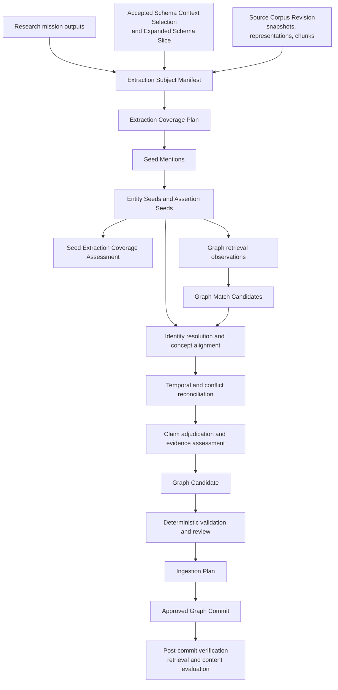

# Ontology-Ready Research-to-Ingestion Architecture

Status: research and architecture synthesis  
Date: 2026-07-27  
Scope: BellLabs longevity and biotech research, ingestion, evaluation, retrieval, and content production  
Implementation target: `biotech-research-ingestion-evaluation-system`  
Specification and ubiquitous-language authority: `biotech-meta`

## 1. Context correction

This document consolidates a design conversation about ontology-guided research transformation and graph ingestion.

The production implementation is:

- `biotech-research-ingestion-evaluation-system`
- OpenAI Agents SDK for agent execution
- Temporal for durable, long-running orchestration
- FastAPI for application and operator surfaces
- cloud-deployed infrastructure

The architectural and domain-language sources are primarily:

- `biotech-meta/docs/CONTEXT.md`
- `biotech-meta/docs/specs/`
- `biotech-meta/docs/research/`
- `biotech-research-ingestion-evaluation-system/docs/`
- the production domain and application code in `biotech-research-ingestion-evaluation-system/app/`

`biotech-kg` contains prior Cursor SDK ingestion experiments. Those experiments may provide useful lessons and fixtures when the program returns, but they are not the target architecture for the work described here. No contract from that prototype should be imported into the production system without reconciliation against the accepted BellLabs language and production workflow boundaries.

The current Schema Definition approach is accepted as a fixed premise for this synthesis:

- a versioned Neo4j GraphQL directive `.graphql` file is the schema source;
- deterministic processes derive the exact Neo4j schema and agent-facing schema resources;
- agents select schema context and express retrieval or ingestion intent;
- application code validates and deterministically executes accepted intent;
- agents do not need to author GraphQL mutations, Cypher, or physical database operations as their semantic output.

This document therefore looks past debates about the canonical schema representation and concentrates on ontology readiness, semantic transformation, validation, inference, ingestion intent, and retrieval quality.

## 2. Product motivation

BellLabs intends to produce sellable informational product slices across at least four large consumer ecosystems:

1. Longevity diagnostics companies and products
2. Consumer supplements
3. Consumer devices
4. Environmental testing

The research-ingestion-evaluation system will run long research missions that discover and analyze companies, products, people, technologies, biomarkers, studies, claims, source documents, historical states, and commercial offerings.

The central design question is:

> After research and high-confidence Schema Context Selection, should reports immediately become ingestion statements, or should the system perform an additional ontology-oriented transformation?

The answer is:

> Perform an additional evidence-grounded semantic extraction and adjudication process. Do not create another prose report, and do not jump directly from narrative synthesis to graph writes.

The target flow is:

```text
Research outputs + exact source artifacts + accepted schema context
  -> extraction-subject and coverage binding
  -> source-grounded Entity Seeds and Assertion Seeds
  -> graph retrieval and Graph Match Candidates
  -> identity resolution, temporal reconciliation, and claim adjudication
  -> Graph Candidate
  -> Ingestion Plan
  -> approved Graph Commit
  -> post-commit retrieval and content evaluation
```

This aligns with the existing BellLabs separation among Research Seed Extraction Result, Graph Match Candidate, Graph Candidate, Ingestion Plan, and Graph Commit.

## 3. Primary architectural conclusion

Research reports are useful semantic maps, but they are not inherently ingestion-safe.

A report sentence can:

- compress several distinct propositions;
- remove qualifications present in the original source;
- merge observations from different dates;
- confuse what a company claims with what BellLabs accepts;
- use one marketing name for several products or product versions;
- describe a derived proxy as a direct measurement;
- omit the population, comparator, endpoint, or study design behind an evidence claim;
- name an institution imprecisely;
- repeat another synthesis rather than the underlying evidence.

Accordingly, the post-research transformation must atomize narrative material into typed, source-located candidate knowledge while preserving epistemic status.

The system should distinguish:

```text
The source says X.
The extraction agent proposes that X means proposition P.
Identity resolution links the mentions in P to canonical referents.
Adjudication accepts, rejects, disputes, scopes, or defers P.
The Graph Candidate proposes accepted knowledge and retained source assertions.
The Ingestion Plan describes ordered physical writes.
```

These are different decisions and must remain independently inspectable.

## 4. Two coordinated ingestion lanes

### 4.1 Documentary and corpus lane

Source and document artifacts can proceed through corpus admission and durable documentary representation without first accepting their semantic claims.

Examples include:

- Source Origin, Source Work, and Source Work Version identity
- Source Representation
- immutable Source Snapshot
- Derived Representation
- Document Artifact
- semantically aware chunks or segments
- content hashes
- exact Source Locators
- research-run and transformation lineage
- embeddings and indexes within a purpose-bound Source Corpus Revision

This lane records what BellLabs captured and can retrieve.

Successful capture or corpus admission does not mean:

- the source is authoritative for every claim;
- its claims are true;
- its entities have been resolved;
- its contents are approved for canonical graph promotion.

### 4.2 Semantic knowledge lane

The semantic lane handles proposed domain knowledge:

- organizations and people;
- products, variants, offerings, and listings;
- lab tests, devices, algorithms, methods, biomarkers, and metrics;
- studies, outcomes, claims, and evidence assessments;
- temporal states and occurrences;
- regulatory and commercial relationships;
- ontology classifications and derived relationships.

This lane requires extraction, resolution, validation, adjudication, and promotion authority.

## 5. The post-schema-selection workflow



### 5.1 Bind exact extraction subjects

The Extraction Subject Manifest should bind exact versions of:

- final mission synthesis;
- stage reports;
- downloaded papers and case-study reports;
- sample customer or biomarker reports;
- cached company and product web pages;
- structured registry or database records;
- prior accepted seeds or graph knowledge;
- the Source Corpus Revision;
- the Schema Context Selection and Expanded Schema Slice.

The manifest must preserve the role of each subject. A final synthesis, a primary paper, a product page, and a sample report do not have the same evidentiary role.

### 5.2 Plan extraction coverage

The extraction operation or Research Seed Extraction Workflow should declare what it is expected to inspect and produce.

For a TruDiagnostic mission, coverage obligations might include:

- organizations and aliases;
- products, product states, and offers;
- lab tests and sample-collection methods;
- algorithms and technology platforms;
- measured or estimated biomarkers and metrics;
- leadership and scientific contributors;
- publications, studies, populations, and outcomes;
- commercial, scientific, and regulatory claims;
- historical changes between 2022 and 2026;
- source and locator completeness;
- unresolved or schema-unmapped concepts.

A seed count is not evidence of adequate coverage. The Seed Extraction Coverage Assessment should distinguish exhaustive, bounded, sampled, unsupported, inaccessible, failed, and unresolved regions.

### 5.3 Extract atomic source-grounded seeds

The production language already provides the correct provisional layer:

- Seed Mention
- Entity Seed
- Assertion Seed
- Evidence Question Seed
- Source Lead
- Research Seed Extraction Result

The earlier conversational term "Source Assertion Ledger" should not automatically become a new ubiquitous-language concept. Its intended function can be satisfied by an appropriately structured Research Seed Extraction Result containing source-grounded Assertion Seeds, exact locators, extraction lineage, confidence profiles, and coverage assessment.

An Assertion Seed should contain enough structure to preserve:

- subject mention;
- proposed subject type;
- predicate or predicate candidate;
- object mention or typed literal;
- proposed object type;
- qualifiers;
- verbatim source text or stable excerpt hash;
- Source Snapshot and Source Locator;
- observed, published, and claimed validity times when available;
- source role and authority assessment relevant to this claim;
- extraction method and operation binding;
- ambiguity and competing interpretations;
- confidence dimensions rather than one unexplained global score.

An Assertion Seed means:

> The extraction process found source material that may support this proposition.

It does not mean:

> This proposition is accepted graph truth.

### 5.4 Retrieve the current graph

Entity Seeds should drive exact, full-text, vector, identifier, and relationship-path retrieval under the selected schema context.

Retrieval emits Graph Match Candidates, not identity decisions.

A Graph Match Candidate should preserve:

- the Entity Seed it may match;
- candidate graph identity;
- match category;
- evidence and query context;
- graph and schema version;
- retrieval failures separately from no-match results;
- confidence basis;
- competing candidates.

The absence of a match means only that the bounded lookup did not return a match. It does not establish that no entity exists.

### 5.5 Resolve identity and concepts

Resolution decisions should include at least:

- `match_existing`
- `create_new`
- `same_entity_new_state`
- `possible_match_requires_review`
- `keep_distinct`
- `unresolved`

Resolution must distinguish:

- company from brand;
- product from variant;
- product from listing or offer;
- test product from Lab Test;
- Lab Test from Test Execution;
- algorithm from Metric;
- directly measured biomarker from estimated proxy;
- institution from affiliated researcher;
- publication from Study;
- sample report from actual patient observation.

External ontology or vocabulary mappings are concept-resolution decisions and should preserve mapping type, external version, evidence, and review state. Shared labels do not prove identity.

### 5.6 Reconcile time and disagreement

For the 2022-2026 window, the system should preserve separate clocks:

- source publication time;
- source observation or capture time;
- asserted validity time;
- graph recording time;
- product-state effective time;
- study or occurrence time.

Unknown validity bounds should remain unknown. A page captured in 2026 proves that the page said something in 2026; it does not automatically establish when the underlying product feature began.

Cross-source reconciliation should classify relationships such as:

- supports;
- contradicts;
- narrows;
- clarifies;
- supersedes;
- duplicates;
- refers to a different version;
- remains unresolved.

Conflicting source assertions should be retained rather than destructively collapsed.

### 5.7 Adjudicate claims

Claim adjudication separates the existence of a source assertion from BellLabs' evaluation of it.

Useful outcomes include:

- well supported;
- promising but limited;
- plausible mechanism only;
- preliminary;
- contradicted;
- overclaimed;
- marketing only;
- safety concern;
- unresolved;
- needs human review.

Adjudication must retain scope:

- exact product or algorithm;
- population;
- specimen;
- method;
- comparator;
- endpoint;
- duration;
- jurisdiction;
- product or formulation version;
- directness of evidence;
- known limitations and conflicts.

### 5.8 Assemble the Graph Candidate

The conversational term "Knowledge Commit Intent" described a semantic, target-independent, pre-write artifact. The existing BellLabs term Graph Candidate already substantially covers this role:

> The adjudicated pre-commit view of entities, relationships, claims, documents, media, source refs, and provenance a workflow proposes for graph ingestion.

The preferred approach is therefore to enrich and evaluate the Graph Candidate contract rather than introduce a redundant term unless implementation proves that a separate artifact is necessary.

The Graph Candidate should contain:

- resolved existing identities;
- proposed new identities;
- proposed new versioned states;
- retained source assertions;
- accepted or disputed assertions;
- adjudications and evidence assessments;
- proposed structural relationships;
- proposed asserted relationships;
- proposed regenerable derived relationships;
- document, chunk, and Source Ref connections;
- temporal decisions;
- ontology classifications and external mappings;
- withheld material;
- unresolved concepts;
- schema-fit findings;
- review obligations;
- complete lineage back to extraction subjects and source locators.

### 5.9 Compile the Ingestion Plan

The Ingestion Plan is the validated, reviewable description of ordered graph and corpus writes.

The system should deterministically compile the accepted Graph Candidate into operations such as:

- ensure or update canonical identity;
- create a new versioned state;
- connect a structural relationship;
- create or preserve a source assertion;
- attach Source Refs and locators;
- create an Adjudication or Evidence Assessment;
- materialize a permitted derived relationship;
- update indexes or embeddings;
- defer an operation for review.

The Ingestion Plan, not the Graph Candidate, owns:

- operation ordering;
- idempotency and merge keys;
- execution-target choice;
- GraphQL or parameterized Cypher compilation;
- transaction grouping;
- preconditions and expected effects;
- retry behavior;
- rollback or repair strategy;
- dry-run and approval state.

## 6. Synthetic TruDiagnostic example

Assume a twenty-stage mission covering 2022-2026 produced:

- stage reports with source attribution;
- a final synthesis;
- full scientific and case-study reports;
- semantically aware chunks;
- sample customer-facing biomarker reports;
- articles;
- cached first-party company and product pages;
- structured publication and trial records;
- an accepted Schema Context Selection.

### 6.1 Example source statement

A 2026 TruAge page or sample report says:

> TruAge includes OMICmAge, a multi-omic biological-age algorithm.

The extraction process should not immediately emit:

```text
MERGE (TruAge)-[:USES_PLATFORM]->(OMICmAge)
```

It should first produce separate provisional propositions such as:

```text
TruAge uses or includes OMICmAge.
OMICmAge produces a biological-age metric.
OMICmAge is described as multi-omic.
The source classifies OMICmAge as an algorithm.
```

Each proposition receives its own locator, confidence basis, qualifiers, and ambiguity record.

### 6.2 Example Assertion Seed

```json
{
  "assertion_seed_id": "assertion-seed:truage-omicmage:2026:001",
  "subject": {
    "mention_text": "TruAge",
    "proposed_schema_type": "Product"
  },
  "predicate_candidate": "USES_PLATFORM",
  "object": {
    "mention_text": "OMICmAge",
    "proposed_schema_type": "TechnologyPlatform"
  },
  "qualifiers": {
    "observed_at": "2026-03-30",
    "valid_from": null,
    "valid_to": null
  },
  "source_evidence": {
    "source_snapshot_id": "source-snapshot:truage-page:2026-03-30",
    "source_locator_id": "source-locator:truage-page:omicmage-section",
    "quote_hash": "sha256:..."
  },
  "epistemic_status": "source_assertion",
  "ambiguities": [
    "The selected schema must determine whether USES_PLATFORM or another relationship is semantically correct.",
    "The source does not establish when inclusion began."
  ]
}
```

The exact field names are illustrative. The production contract should use accepted BellLabs naming and production schema models.

### 6.3 Resolution

The system retrieves:

- an existing `Organization` for TruDiagnostic;
- an existing or proposed `Product` for TruAge;
- no exact existing OMICmAge identity;
- related papers and product snapshots.

Possible decisions:

```text
TruDiagnostic -> match_existing
TruAge -> match_existing
OMICmAge -> create_new TechnologyPlatform
2026 TruAge configuration -> create new or reuse current ProductSnapshot
```

If "TruAge Complete" appears in a shop listing, the system must determine whether it is:

- the same Product name;
- a Product Variant;
- a listing title;
- a package configuration;
- a renamed or superseded product.

It must not resolve this by string similarity alone.

### 6.4 Sample-report semantics

A sample customer report can establish:

- which outputs appeared in that report version;
- metric labels;
- presentation structure;
- score ranges and interpretations;
- whether an output was described as measured or estimated;
- the algorithm names exposed to the customer.

It does not establish:

- an actual person's observation;
- a real patient result;
- population-level validity;
- a clinical outcome;
- the current commercial package without temporal corroboration.

If the sample report says that telomere length is estimated from DNA methylation, the proposed model should preserve:

```text
TruAge produces an Estimated Telomere Length metric.
The metric is derived using a DNA-methylation proxy method.
The metric estimates telomere length.
```

It should not assert:

```text
TruAge directly measures telomere length.
```

### 6.5 Scientific-paper semantics

An OMICmAge paper can support:

```text
Document reports on Study.
Study evaluates OMICmAge.
Study has a defined population.
Study has outcomes and statistical results.
Document asserts performance claims.
Evidence Assessment evaluates applicability and strength.
```

It should not be reduced to:

```json
{
  "omicmage_validated": true,
  "omicmage_accurate": true
}
```

Validity and performance are scoped conclusions, not timeless booleans.

### 6.6 Marketing and institutional claims

A phrase such as "developed with Harvard" is not sufficient to create:

```text
Harvard University developed OMICmAge.
```

The phrase may refer to:

- an institution;
- a hospital or laboratory;
- an affiliated researcher;
- a formal research collaboration;
- a marketing shorthand.

The Assertion Seed should retain the phrase and ambiguity. Publication affiliations, author contributions, official partnership material, and contracts or announcements may later support a more precise relationship.

Similarly:

> Blood collection is more accurate than saliva-based competitors.

should initially remain a comparative Claim attributed to its source. It should not become a canonical Product property unless an evidence assessment supports a precise, scoped conclusion.

### 6.7 Leadership over time

If sources report:

```text
2022: Ryan Smith, founder and CEO
2025: Ryan Smith, founder and head of research
2026: Ryan Smith, global head of research and development
```

the system should not repeatedly overwrite one `role` property.

It should preserve time-bounded or observation-bounded role assertions and distinguish:

- role title;
- organization;
- source;
- observed time;
- known or unknown effective bounds;
- potentially overlapping roles;
- supersession or unresolved transition.

### 6.8 Resulting Graph Candidate

After resolution and adjudication, the Graph Candidate may propose:

- reuse the existing TruDiagnostic organization;
- reuse or update the TruAge product identity;
- create OMICmAge as the schema-selected type;
- create or attach a 2026 Product Snapshot;
- retain the product-page source assertion that TruAge includes OMICmAge;
- accept the relationship for the 2026 observed state if corroborated;
- connect the sample report as documentary evidence of exposed outputs;
- connect the scientific paper to its Study and claims;
- defer "developed with Harvard" for institutional-role review;
- retain "more accurate than saliva" as an unadjudicated or marketing Claim;
- create no patient observation from a sample report;
- preserve unresolved start dates rather than inventing them.

Only then should the Ingestion Plan compile physical operations.

## 7. Ontology, taxonomy, and validation strategy

### 7.1 A hybrid semantic architecture

The operational Neo4j property graph and GraphQL schema should remain optimized for:

- agent schema selection;
- ingestion and retrieval intent;
- deterministic execution;
- application queries;
- traversal and filtering;
- client development.

Ontology-oriented artifacts can complement that operational model:

- SKOS-like concept schemes for editorial and consumer-facing classification;
- RDFS/OWL mappings and axioms where formal inference is valuable;
- SHACL-like validation shapes or equivalent generated validation rules;
- external vocabulary mappings;
- versioned inference rules;
- competency questions and retrieval tests.

The production graph does not need to become a native RDF store for the system to benefit from ontology engineering.

### 7.2 Separate inference from validation

The system must not conflate OWL/RDFS inference with closed-world operational validation.

Use:

- Pydantic/JSON Schema for intent-document structure;
- deterministic schema validation for node, property, relationship, union, and enum conformance;
- graph constraints and application policy for identity, uniqueness, transactions, and write safety;
- SHACL or an equivalent shape layer for graph completeness and cross-node invariants;
- RDFS/OWL or explicit versioned rules for classification and derivation;
- human or delegated review for ambiguity, consequential claims, and ontology evolution.

Examples:

```text
Inference:
DNA methylation assay is an epigenetic measurement method.
Test X uses a DNA methylation assay.
Therefore Test X uses an epigenetic measurement method.
```

```text
Validation:
Every accepted source-derived Assertion has an exact Source Locator.
Every Assertion has one subject.
Every relational Assertion has an allowed predicate and compatible endpoints.
Every derived edge identifies its derivation rule or source assertions.
```

Inference must not silently produce:

```text
Uses an epigenetic method -> clinically valid biological-age test
Contains an ingredient -> supported by every study of that ingredient
Uses red light -> treats a disease
```

### 7.3 Derived knowledge

Every materialized derived relationship should preserve:

- derivation rule identifier and version;
- ontology or taxonomy version;
- input assertion identifiers;
- generation time;
- recomputability;
- review or acceptance state when applicable.

Derived edges should never become the only historical record.

## 8. Multi-axial ecosystem modeling

The initial product-surface categories should not be modeled as one exclusive tree.

### 8.1 Longevity diagnostics

Use independent axes such as:

- intended purpose;
- biological layer;
- analyte or biomarker family;
- measurement method;
- technology platform;
- specimen;
- collection setting;
- directly measured versus estimated or inferred output;
- output metric;
- evidence maturity;
- regulatory and commercial status.

This prevents categories such as epigenetic-age testing, multi-omics profiling, proteomics-based biomarkers, telomere analysis, hormone profiling, microbiome testing, and metabolomics testing from being forced into mutually exclusive siblings.

### 8.2 Consumer supplements

Important dimensions include:

- product, variant, package, listing, and offer identity;
- formulation version;
- Ingredient Material and Ingredient Component;
- quantity, unit, serving basis, and dosage form;
- claimed consumer goal;
- mechanism claims;
- study intervention identity;
- evidence applicability to the exact formulation;
- quality, testing, certification, and lot evidence;
- temporal commerce state.

### 8.3 Consumer devices

Important dimensions include:

- measurement, intervention, or hybrid function;
- wellness product versus regulated medical device;
- modality;
- delivered energy and parameters;
- sensor and measured metric;
- mechanism or intended mechanism;
- body target;
- form factor;
- protocol and use setting;
- safety constraints;
- evidence for the modality versus evidence for the exact device;
- software, content, subscription, and data/privacy components.

### 8.4 Environmental testing

Distinguish:

- environmental hazard or analyte;
- environmental medium;
- sampling kit;
- sampling method;
- assay or Lab Test;
- laboratory service;
- Test Execution;
- measured result;
- interpretation threshold or regulatory reference;
- remediation or avoidance recommendation.

"Mold test" may refer to several of these identities and should not be one overloaded entity.

## 9. Existing terminology and proposed refinements

The following existing BellLabs terms should remain central:

- Schema Definition
- Schema Catalog
- Schema Context Selection
- Expanded Schema Slice
- Schema Operation Projection
- Extraction Subject Manifest
- Research Seed Extraction Result
- Entity Seed
- Assertion Seed
- Evidence Question Seed
- Seed Extraction Coverage Assessment
- Seed Use Readiness Assessment
- Graph Match Candidate
- Source Snapshot
- Source Locator
- Source Ref
- Assertion
- Adjudication
- Evidence Assessment
- Graph Candidate
- Ingestion Plan
- Graph Commit

Two conversational labels require reconciliation:

### Source Assertion Ledger

Likely disposition:

- do not add as a new top-level domain term yet;
- implement its needed behavior through Assertion Seeds inside the Research Seed Extraction Result;
- add a deterministic ledger projection only if operators or downstream workflows need a specialized query/read model.

### Knowledge Commit Intent

Likely disposition:

- treat it as the intended role of an enriched Graph Candidate;
- keep physical write ordering and execution semantics in the Ingestion Plan;
- introduce a separate term only if Graph Candidate becomes too broad or cannot express semantic desired state independently of the write plan.

## 10. Evaluation

Ontology readiness and ingestion quality should be evaluated independently across several layers.

### 10.1 Extraction

- entity detection precision and recall;
- assertion detection precision and recall;
- locator correctness;
- source-to-seed lineage completeness;
- typing accuracy;
- qualifier and temporal extraction accuracy;
- ambiguity preservation;
- coverage by obligation and artifact region.

### 10.2 Resolution

- entity-linking accuracy;
- duplicate creation rate;
- false merge rate;
- correct distinction among product, variant, listing, test, execution, algorithm, and metric;
- external concept-mapping accuracy;
- calibration of match and no-match decisions.

### 10.3 Adjudication

- correct separation of marketing, observation, evidence, and BellLabs conclusion;
- contradiction recall;
- scope preservation;
- evidence-applicability accuracy;
- human overturn rate;
- safety-sensitive escalation accuracy.

### 10.4 Ingestion

- schema conformance;
- provenance completeness;
- idempotent replay;
- correct temporal-state creation;
- no hidden destructive changes;
- post-commit invariant violations;
- successful repair after partial failure.

### 10.5 Retrieval and product utility

- competency-question accuracy;
- precision, recall, MRR, and nDCG where appropriate;
- facet and classification accuracy;
- historical-answer correctness;
- contradiction retrieval;
- citation faithfulness;
- company and product comparison coverage;
- ability to explain classification and evidence paths;
- editorial correction rate;
- time required to refresh an ecosystem.

These dimensions should not collapse into one aggregate "ontology quality" score.

## 11. Production-system implications

The production implementation should express these responsibilities as durable workflow and operation boundaries rather than one opaque agent pass.

Potential workflow composition:

```text
Knowledge Production Mission
  -> Source Discovery / Source Intelligence work
  -> Source Corpus build or revision
  -> Schema Context Selection
  -> Research Seed Extraction
  -> identity-resolution workflow or governed resolution stage
  -> evidence research and Claim Adjudication
  -> Graph Candidate assembly
  -> Ingestion Plan
  -> approval
  -> Ingestion Execution / Graph Commit
  -> post-commit Evaluation
  -> Curated Content
```

Temporal should preserve:

- exact input and output artifact versions;
- Effective Run Configuration;
- Operation Execution Bindings;
- linked-run authority and budget;
- review and approval decisions;
- retries and repair attempts;
- stage and operation events;
- immutable lineage across reruns and superseded outputs.

FastAPI and operator surfaces should expose:

- mission and linked-run status;
- coverage and unresolved regions;
- Assertion Seeds and their locators;
- Graph Match Candidates;
- resolution and adjudication decisions;
- Graph Candidate diffs;
- Ingestion Plan dry runs;
- approval and rejection;
- post-commit verification;
- retrieval and evaluation results.

## 12. Recommended next design slice

Use longevity diagnostics and TruDiagnostic as the first end-to-end ontology-readiness fixture.

The slice should produce:

1. A versioned extraction subject manifest for a representative 2022-2026 artifact set.
2. An accepted Schema Context Selection and Expanded Schema Slice.
3. A coverage plan for company, product, algorithm, metric, leadership, study, and source knowledge.
4. Source-grounded Entity Seeds and Assertion Seeds.
5. Graph Match Candidates from a controlled graph fixture.
6. Identity and temporal-resolution decisions.
7. At least one accepted, disputed, marketing-only, superseded, and unresolved assertion.
8. A Graph Candidate with complete source lineage.
9. A deterministic dry-run Ingestion Plan.
10. Post-commit competency-question tests.

The fixture should deliberately include difficult cases:

- TruAge versus TruAge Complete;
- product versus Lab Test;
- OMICmAge algorithm versus biological-age Metric;
- estimated telomere length versus direct measurement;
- "developed with Harvard";
- a sample report that must not create a patient observation;
- conflicting or differently rounded CpG/probe counts;
- changing leadership roles;
- a first-party comparative accuracy claim;
- a later paper that clarifies but does not automatically validate every commercial claim.

## 13. Key decisions from the conversation

1. Keep the current versioned Neo4j GraphQL Schema Definition premise.
2. Optimize schema resources for agent selection and retrieval or ingestion intent.
3. Keep deterministic execution behind validated intent artifacts.
4. Do not transform research reports directly into database operations.
5. Bind reports and original source artifacts as exact extraction subjects.
6. Use reports for routing, synthesis, and coverage, while descending to original source evidence when available.
7. Use source-grounded Entity Seeds and Assertion Seeds as the provisional semantic layer.
8. Separate graph retrieval evidence from source evidence.
9. Preserve source assertions separately from BellLabs adjudications.
10. Perform identity, temporal, conflict, and concept resolution before Graph Candidate assembly.
11. Use Graph Candidate as the semantic pre-commit intent unless a proven gap requires another artifact.
12. Keep physical ordering, idempotency, GraphQL/Cypher compilation, transactions, and repair in the Ingestion Plan.
13. Maintain separate documentary/corpus and semantic-promotion lanes.
14. Treat classifications as multi-axial rather than one exclusive taxonomy.
15. Separate open-world inference from closed-world validation and transactional policy.
16. Make every derived relationship reproducible from versioned rules and source assertions.
17. Evaluate extraction, resolution, adjudication, ingestion, retrieval, and product utility separately.
18. Implement and test this architecture in `biotech-research-ingestion-evaluation-system`, with accepted language and architecture maintained in `biotech-meta`.

## 14. Related internal material

- [`CONTEXT.md`](../CONTEXT.md)
- [`starter-content-research-ingestion-workflow.md`](../starter-content-research-ingestion-workflow.md)
- [`2026-07-16-source-intelligence-workflow-research.md`](./2026-07-16-source-intelligence-workflow-research.md)
- [`CODEBASE_DOMAIN_WORKFLOW_GUIDE.md`](../../../biotech-research-ingestion-evaluation-system/docs/CODEBASE_DOMAIN_WORKFLOW_GUIDE.md)
- [`SCHEMA_GROUNDING_PIPELINE.md`](../../../biotech-research-ingestion-evaluation-system/docs/SCHEMA_GROUNDING_PIPELINE.md)
- [`workflow-control-plane-current-state-and-next-slices.md`](../../../biotech-research-ingestion-evaluation-system/docs/workflow-control-plane-current-state-and-next-slices.md)

## 15. Standards and external references considered

- [RDF](https://www.w3.org/RDF/)
- [RDFS](https://www.w3.org/TR/rdf-schema/)
- [OWL 2 Overview](https://www.w3.org/TR/owl2-overview/)
- [OWL 2 Profiles](https://www.w3.org/TR/owl2-profiles/)
- [SHACL](https://www.w3.org/TR/shacl/)
- [SKOS](https://www.w3.org/TR/skos-reference/)
- [PROV-O](https://www.w3.org/TR/prov-o/)
- [OBO Foundry](https://obofoundry.org/)
- [OBO Foundry versioning principle](https://obofoundry.org/principles/fp-004-versioning.html)
- [Neo4j neosemantics](https://neo4j.com/labs/neosemantics/)
- [Extract, Define, Canonicalize: An LLM-based Framework for Knowledge Graph Construction](https://aclanthology.org/2024.emnlp-main.548/)

These references inform the design but do not supersede BellLabs domain contracts, workflow authority, or production implementation decisions.
