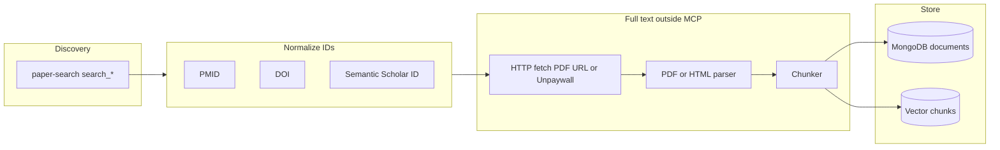

# Paper-search-mcp: full text, downloads, metadata — and how this differs from clinical trials

**Date:** 2026-03-24  
**Worked example (paper):** PMID **37507915** / DOI **10.3390/antiox12071375** (topical glutathione–cyclodextrin pilot, *Antioxidants* 2023).  
**Worked example (trial registry record):** **NCT01140438** (fetched via **medical-research** MCP — *not* paper-search).

---

## 1. Papers vs “trials” (important distinction)

| Kind | What it is | Typical “sections” | Which tools |
|------|------------|----------------------|-------------|
| **Journal article / preprint** | Peer-reviewed or preprint PDF/HTML | Abstract, Introduction, Methods, Results, Discussion, References (publisher-dependent; not standardized) | **paper-search-mcp** (metadata + sometimes PDF URLs); your own PDF pipeline for body text |
| **ClinicalTrials.gov record** | Structured registry entry for a study protocol (may or may not have posted results) | **`protocolSection` modules**: identification, status, sponsors, description, conditions, design, arms/interventions, outcomes, eligibility, contacts/locations, references; plus **`derivedSection`** (e.g. MeSH browse); optional results posted separately on CT.gov | **medical-research** `ct_search_trials` / `ct_get_study`, or [ClinicalTrials.gov API v2](https://clinicaltrials.gov/data-api/api) |

The pilot paper (37507915) **describes** a small human study; it is **not** the same object as an **NCT** record. If the study were registered, you would link **PMID ↔ NCT** via citation fields or manual curation.

---

## 2. paper-search-mcp — complete tool surface

### 2.1 Discovery (`search_*`)

| Tool | ID format in results | Typical fields returned |
|------|----------------------|-------------------------|
| `search_pubmed` | `paper_id` = PMID (numeric string) | title, authors, abstract, doi, url (PubMed), `pdf_url` often empty |
| `search_arxiv` | `paper_id` like `2603.22266v1` | abstract, `pdf_url`, abs url |
| `search_crossref` | `paper_id` = DOI | title, authors, doi, url, type, citations (sometimes) |
| `search_semantic` | `paper_id` = Semantic Scholar corpus ID (40-char hex) | abstract, doi, `pdf_url` when known, url |
| `search_medrxiv` | `paper_id` = medRxiv DOI style id | `pdf_url` often present |
| `search_biorxiv` | `paper_id` = bioRxiv DOI `10.1101/...` | `pdf_url` often present |
| `search_iacr` | IACR ePrint ids | preprint metadata |
| `search_google_scholar` | varies | often sparse or empty in practice |
| `search` | **aggregated** ids: `pubmed:…`, `arxiv:…`, `biorxiv:…` | minimal: id, title, url |

**Worked calls on the glutathione paper**

- `search_pubmed` with query `37507915` → full PubMed-style metadata + abstract.
- `get_crossref_paper_by_doi` `10.3390/antiox12071375` → Crossref metadata + JATS-flavored abstract HTML in `abstract` field; `pdf_url` empty in Crossref response (publisher handles PDF).
- `search_semantic` with full title → **same paper**, `paper_id` = `f931bafaf2ebe1967a0a47b29a5636a07d08f17b`, and a **publisher PDF URL**:  
  `https://www.mdpi.com/2076-3921/12/7/1375/pdf?version=1688350805`
- `search` with title keywords → includes `pubmed:37507915` in mixed results.

### 2.2 Single-record lookup

| Tool | Input | Output |
|------|--------|--------|
| `get_crossref_paper_by_doi` | DOI | Rich metadata (authors, title, abstract, type, citations) |

### 2.3 Full text: `fetch`

| Call (example) | Outcome (this session) |
|----------------|-------------------------|
| `fetch` id=`37507915`, document_id=`37507915` | `text`: “Content unavailable. Use the paper URL…” |
| `fetch` id=`pubmed:37507915` | Same |
| `fetch` id=Semantic Scholar hash | Same |

So in this environment, **`fetch` did not return extracted body text** for these ids.

### 2.4 Download (`download_*`)

| Tool | Outcome (this session) |
|------|-------------------------|
| `download_pubmed` PMID `37507915` | Message: **PubMed does not provide direct PDF downloads** — use DOI / publisher |
| `download_crossref` DOI `10.3390/antiox12071375` | Message: **CrossRef does not provide direct PDF** — use publisher |
| `download_semantic` Semantic Scholar id | Message: **PDF download is not available in the hosted version** |
| `download_arxiv` `2603.22266v1` | Same **hosted** limitation message |
| `download_medrxiv` (paper with `pdf_url` in search result) | Same **hosted** limitation message |

**Interpretation:** There are **two** layers of limits:

1. **Source limits:** PubMed and CrossRef are **metadata APIs** — they are not bulk PDF hosts for publisher content.
2. **MCP deployment limits:** The **hosted** paper-search MCP explicitly disables PDF download and text extraction (`read_*` below), even for arXiv/medRxiv where a public PDF URL exists.

On a **self-hosted** paper-search-mcp instance, `download_*` / `read_*` may work as intended; verify against the server you run.

### 2.5 Read / extract text (`read_*`)

| Tool | Outcome (this session) |
|------|-------------------------|
| `read_pubmed_paper` | Only metadata/abstract via PubMed — **not** full text through this tool |
| `read_crossref_paper` | Same |
| `read_semantic_paper` | **Paper reading/text extraction is not available in the hosted version** |
| `read_arxiv_paper` | Same hosted limitation |

---

## 3. What you *can* persist today (hosted paper-search)

For **37507915** you can reliably store:

- **Identifiers:** PMID, DOI, Semantic Scholar id (optional).
- **Bibliographic metadata:** title, authors, journal (via Crossref or PubMed), year.
- **Abstract:** plain (PubMed) or JATS snippet (Crossref).
- **Open-access PDF URL:** from Semantic Scholar when present (not a guarantee for all papers).
- **Landing URLs:** PubMed page, DOI resolver, publisher HTML.

You **cannot** rely on this MCP alone (hosted) for:

- Downloaded PDF bytes  
- Parsed sections (Methods, Results, …)  
- Reference lists from full text  

---

## 4. Recommended architecture for DB + chunks (papers)

### 4.1 Ingestion graph



1. **Discovery:** `search_pubmed` / `search_semantic` / `search_crossref` → collect PMID, DOI, `pdf_url`, publisher URL.  
2. **Resolve PDF:** If `pdf_url` missing, use **Unpaywall** (DOI), **Europe PMC** (PMID), or publisher-specific open access rules (respect licenses).  
3. **Fetch PDF/HTML** with your worker (not assumed in hosted MCP).  
4. **Parse:** `pymupdf`, `pdfplumber`, or **GROBID** for structured sections when you need headings.  
5. **Chunk:**  
   - **Semantic:** section-aware if parser gives headings; else sliding window with overlap (e.g. 512–1k tokens, 10–15% overlap).  
   - **Metadata per chunk:** `source_type: paper`, `pmid`, `doi`, `section_guess`, `page`, `char_offset`.

### 4.2 MongoDB document shape (example)

```json
{
  "sourceType": "literature",
  "pmid": "37507915",
  "doi": "10.3390/antiox12071375",
  "semanticScholarId": "f931bafaf2ebe1967a0a47b29a5636a07d08f17b",
  "title": "...",
  "abstract": "...",
  "authors": [],
  "openAccessPdfUrl": "https://www.mdpi.com/.../pdf",
  "fetched": {
    "pdfStorageKey": "s3://.../37507915.pdf",
    "fetchedAt": "ISODate",
    "license": "CC-BY or unknown"
  },
  "sections": [
    { "name": "Introduction", "text": "..." }
  ],
  "chunkIds": ["ObjectId(...)", "..."]
}
```

Chunks collection: `parentDocumentId`, `chunkIndex`, `text`, `embeddingRef`, `provenance`.

---

## 5. Clinical trials: sections and fetching (not paper-search)

Trial **metadata** is **hierarchical JSON**, not a PDF. Example from **medical-research** `ct_get_study` for **NCT01140438**:

| Section (API path) | Content |
|---------------------|---------|
| `protocolSection.identificationModule` | `nctId`, brief/official title, org, acronym |
| `protocolSection.statusModule` | overall status, dates |
| `protocolSection.sponsorCollaboratorsModule` | sponsors |
| `protocolSection.oversightModule` | DMC, FDA flags |
| `protocolSection.descriptionModule` | `briefSummary`, `detailedDescription` |
| `protocolSection.conditionsModule` | conditions, keywords |
| `protocolSection.designModule` | study type, phase, allocation, masking, enrollment |
| `protocolSection.armsInterventionsModule` | arms, intervention details |
| `protocolSection.outcomesModule` | primary/secondary outcomes |
| `protocolSection.eligibilityModule` | criteria text block, age, sex |
| `protocolSection.contactsLocationsModule` | sites, officials |
| `protocolSection.referencesModule` | linked publications (often PMIDs) |
| `derivedSection` | MeSH browse, misc |
| Top-level flags | e.g. `hasResults` (whether results are posted on CT.gov) |

**Chunking trials for RAG**

- One **document** per `nctId`.  
- **Chunks = modules** or subfields: e.g. split `eligibilityCriteria` (Inclusion vs Exclusion if you parse the list), each outcome as its own chunk, each arm description as its own chunk.  
- Store raw JSON in Mongo for audit; denormalize text fields for search.

**Linking paper ↔ trial**

- Use `referencesModule.references[].pmid` from the trial.  
- Use “trial registration” sentences in the paper’s Methods.  
- External graphs (e.g. Europe PMC links) if you add them later.

---

## 6. Summary table: what paper-search gives you per identifier

| Action | PMID `37507915` | DOI `10.3390/...` | Semantic Scholar hash |
|--------|-----------------|-------------------|-------------------------|
| Metadata + abstract | Yes (`search_pubmed`) | Yes (`get_crossref_paper_by_doi`) | Yes (`search_semantic`) |
| PDF URL hint | Unreliable via PubMed | Often empty in Crossref | **Yes** (MDPI PDF in our run) |
| `download_*` PDF bytes (hosted MCP) | No | No | No |
| `read_*` extracted text (hosted MCP) | No | No | No |
| `fetch` body text (hosted MCP) | No | No | No |

---

## 7. Practical next steps for your codebase

1. **Treat paper-search-mcp as a discovery and metadata layer** in production; assume **full text** comes from your own fetch + parse pipeline using DOI / OA links.  
2. **Re-test `download_*` and `read_*`** when you run paper-search-mcp **locally**; behavior may differ from hosted.  
3. **Trials:** use **`ct_get_study`** (or direct ClinicalTrials.gov v2 JSON) and chunk by **`protocolSection` modules**, not by PDF sections.  
4. **Unify graph:** collection `edges` with `{ from: {type:'pmid', id}, to: {type:'nct', id}, relation:'registered_as' }` when you have evidence.

---

## References

- Episode-linked paper (PubMed): https://pubmed.ncbi.nlm.nih.gov/37507915/  
- Publisher (open access PDF on MDPI): https://doi.org/10.3390/antiox12071375  
- Example trial record: https://clinicaltrials.gov/study/NCT01140438  
